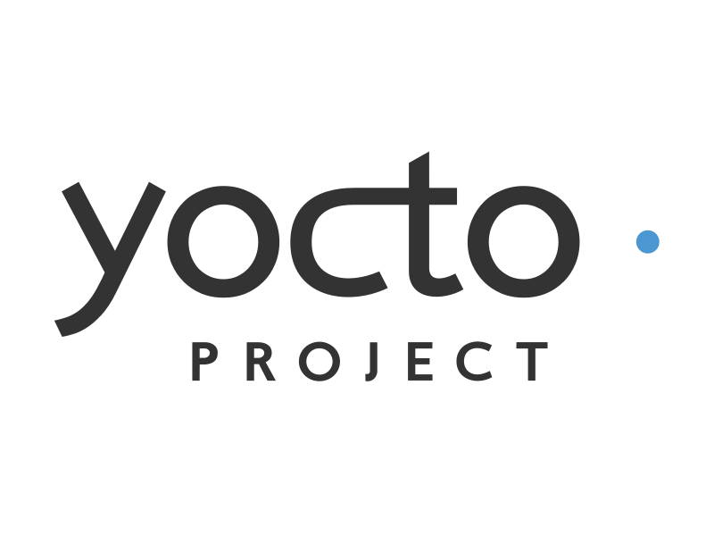
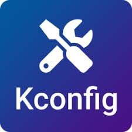

<style>
.slidev-code {
   font-size: 10px !important;
   line-height: 15px !important;
}
</style>

<!--
Hi everyone, and welcome to: “Feasibility and Architecture of a Dual-Board Embedded System: Yocto & Zephyr Integration.”
Which sounds like a fancy title, but rest assured, this presentation focuses less on jargon and more on the practical journey: from the initial concept through hardware and software development, culminating in a fully operational system.
-->

---

::title::

About Us

::body::

<div class="flex flex-row justify-around">
   <div class="flex flex-col justify-center items-center">
      <div class="text-3xl font-semibold">
         Amarula Solutions
      </div>
      <a href="mailto:info@amarulasolutions.com" class="text-xl text-blue-500 underline">info@amarulasolutions.com</a>
      <a href="www.amarulasolutions.com" class="text-xl text-blue-500 underline">
      www.amarulasolutions.com
      </a>
      <hr class="my-4">
      </hr>
      <ul class="text-l">
         <li>
            Software Consulting Across Europe
            <ul>
               <li>Offices in multiple European countries</li>
               <li>Focused on mobile apps, cloud platforms, and embedded systems</li>
            </ul>
         </li>
         <li>
            Full-Stack Embedded Expertise
            <ul>
               <li>From bootloaders & kernels to UI applications</li>
               <li>Deep knowledge of Android & Linux OS</li>
            </ul>
         </li>
         <li>
            Open Source at Our Core
            <ul>
               <li>Active upstream contributions</li>
               <li>Solutions built for security and long-term maintainability</li>
            </ul>
         </li>
      </ul>
   </div>
   <div class="flex flex-col justify-center">
      <div>
         
         
      </div>
   </div>
</div>

<!--
Let me start with a quick intro to our company.
We work at Amarula Solutions, a software consulting firm with offices across Europe. We specialise in mobile applications, cloud platforms, and embedded systems, particularly those built on Linux and Android operating systems.
Our unique strength lies in our vertical integration, as we handle everything from bootloaders and kernels to user-facing applications.
At our core, we’re open source advocates. We contribute upstream regularly and build solutions that prioritise security and long-term maintainability.
-->

---

::title::

About Us

::body::

<div class="flex flex-row justify-around">
   <div class="flex flex-col justify-center items-center">
      <div class="text-3xl font-semibold">
         Andrea Ricchi
      </div>
      <a href="mailto:andrea.ricchi@amarulasolutions.com" class="text-xl text-blue-500 underline">andrea.ricchi@amarulasolutions.com</a>
      <a href="https://github.com/AndreaRicchi" class="text-xl text-blue-500 underline">
      https://github.com/AndreaRicchi
      </a>
      <hr class="my-4">
      </hr>
      <ul class="text-l">
         <li>C</li>
         <li>C++ & Qt</li>
         <li>Dart & Flutter</li>
         <li>Yocto & Buildroot</li>
      </ul>
   </div>
   <div class="flex flex-col justify-between space-y-2">
      <div>
         
      </div>
      <iframe
         src="https://www.google.com/maps/embed?pb=!1m18!1m12!1m3!1d45313.59690505175!2d10.876755850000011!3d44.77877055!2m3!1f0!2f0!3f0!3m2!1i1024!2i768!4f13.1!3m3!1m2!1s0x477f8d2da31002a3%3A0xe3b13d5ff519c63f!2s41012%20Carpi%20MO!5e0!3m2!1sit!2sit!4v1750767724786!5m2!1sit!2sit"
         class="w-54 h-54 rounded-xl shadow"
         loading="lazy"
         referrerpolicy="no-referrer-when-downgrade"
         >
      </iframe>
   </div>
</div>

<!--
A few words about me:
I’m Andrea Ricchi, an embedded developer from Carpi, Italy.
My expertise lies in developing user-space services in C and C++, as well as creating UI applications using Qt and Flutter.
I actively contribute to open-source projects, including ConnMan, and I maintain some Qt components and Flutter packages. I also have hands-on experience with Yocto and Buildroot.
-->

---

::title::

About Us

::body::

<div class="flex flex-row justify-around">
   <div class="flex flex-col justify-center items-center">
      <div class="text-3xl font-semibold">
         Dario Binacchi
      </div>
      <a href="mailto:dario.binacchi@amarulasolutions.com" class="text-xl text-blue-500 underline">dario.binacchi@amarulasolutions.com</a>
      <a href="https://github.com/passgat" class="text-xl text-blue-500 underline">
      https://github.com/passgat
      </a>
      <a href="https://openhub.net/accounts/passgat" class="text-xl text-blue-500 underline">
      https://openhub.net/accounts/passgat
      </a>
      <hr class="mt-4">
      <ul class="text-l">
           <li>Buildroot</li>
           <li>Yocto</li>
           <li>Linux</li>
           <li>U-Boot</li>
           <li>Zephyr</li>
      </ul>
   </div>
   <div class="flex flex-col justify-between space-y-2">
      <div>
         
      </div>
      <iframe
         src="https://www.google.com/maps/embed?pb=!1m18!1m12!1m3!1d22505.986572273636!2d10.752651133928621!3d45.16182115862277!2m3!1f0!2f0!3f0!3m2!1i1024!2i768!4f13.1!3m3!1m2!1s0x4781d40f82e52ed9%3A0xc1c7fd07590e7b85!2s46100%20Mantua%2C%20Province%20of%20Mantua!5e0!3m2!1sen!2sit!4v1752586166160!5m2!1sen!2sit"
         class="w-58 h-54 rounded-xl shadow"
         loading="lazy"
         referrerpolicy="no-referrer-when-downgrade"
         >
      </iframe>
   </div>
</div>

<!--

Hi, I’m Dario Binacchi.

At <span style="color: red; font-weight: bold;">Amarula</span>, I mainly work on
<span style="color: red; font-weight: bold;">creating</span> and
<span style="color: red; font-weight: bold;">adapting</span> the
<span style="color: red; font-weight: bold;">BSPs</span> for the boards we support.

I’m an open source contributor to projects like Buildroot, U-boot, Linux and
Zephyr.

Together with my colleague Michael Trimarchi, I am the
<span style="color: red; font-weight: bold;">custodian</span> of the NAND subsystem in 
<span style="color: red; font-weight: bold;">U-Boot</span>,
and in the <span style="color: red; font-weight: bold;">Linux</span> kernel, the
<span style="color: red; font-weight: bold;">maintainer</span> of the BxCAN
and SLCAN drivers which are part of the CAN subsystem.

I live in a small town near Mantua, in northern Italy.

-->

---

::title::

Agenda

::body::

<div class="flex justify-center gap-x-32 text-4xl -ml-32">
  <div class="flex flex-col justify-start">
    <ul class="list-disc pl-5">
      <li>Hardware setup</li>
      <li>Yocto</li>
      <li>Flutter</li>
      <li>Zephyr</li>
    </ul>
  </div>
  <div class="flex flex-col justify-start">
    <ul class="list-disc pl-5">
      <li>LVGL</li>
      <li>Demo</li>
      <li>Q&amp;A</li>
    </ul>
  </div>
</div>

<!--
This presentation will describe our experience  — from the
<span style="color: red; font-weight: bold;">first idea</span> to the
<span style="color: red; font-weight: bold;">final implementation</span> — and
<span style="color: red; font-weight: bold;">share the main challenges</span> we
met along the way.

<span style="color: red; font-weight: bold;">We'll begin with</span> the hardware setup,
<span style="color: red; font-weight: bold;">consisting</span> of a main and sensor
board, <span style="color: red; font-weight: bold;">then we will cover </span>the
Yocto build system and Flutter UI framework on the main board and Zephyr with the
LVGL library on the sensor one.

Finally, we will show a short video
<span style="color: red; font-weight: bold;">of how</span> the demo works</span>.
-->

---
preload: false
---

::title::

Back to the roots

::body::

<div class="grid grid-cols-2 gap-4 items-start">
  <div>
    <div class="text-4xl font-bold mt-4 mb-6">Embedded World 2025</div>
    <ul class="font-bold list-disc pl-5 space-y-2">
      <li>Embedded Linux build systems</li>
      <li>Graphical frameworks</li>
      <li>FOSS contributions</li>
      <li>Integration and adaption to new hardware</li>
      <li>
        ST authorized partner
        <a
          href="https://www.st.com/content/st_com/en/partner/partner-program/partnerpage/amarula-solutions.html"
          class="text-blue-500 underline"
          target="_blank" rel="noopener noreferrer"
        >
          program
        </a>
      </li>
      <li>Using upstream-oriented software to support CRA compliance</li>
      <li>Designing a reusable infrastructure</li>
      <li>Showcasing at Engicam booth</li>
    </ul>
  </div>

  <div>
    <div class="text-4xl font-bold mt-4 mb-6">Output</div>
    <ul class="font-bold list-disc pl-5 space-y-2">
      <li>Smart thermostat demo</li>
      <li>Main board
        <ul class="font-normal list-disc pl-5">
          <li>EDIMM 2.0 EVK - STM32MP257 SOM</li>
          <li>Yocto - scarthgap</li>
          <li>Flutter - 3.32.2</li>
        </ul>
      </li>
      <li>Sensor board
        <ul class="font-normal list-disc pl-5">
          <li>STM32F429I-DISC1 board</li>
          <li>Temperature, pressure and humidity sensors</li>
          <li>Zephyr RTOS - 4.0.0</li>
          <li>LVGL UI - 8.4.0</li>
        </ul>
      </li>
      <li>Boards communication over CAN bus</li>
    </ul>
  </div>
</div>

<!--
Before diving into what I just outlined, let me say a few words about the origin
of this talk. It was November 2024, and at Amarula, we had to decide what to
present at Embedded World in March 2025.

The target was to showcase not only the
<span style="color: red; font-weight: bold;">technologies</span> we are familiar
with, but also the <span style="color: red; font-weight: bold;">principles</span>
behind our engineering choices — like using software packages as close as possible
to mainline versions, in order to meet the
<span style="color: red; font-weight: bold;">security</span> and
<span style="color: red; font-weight: bold;">maintainance</span> requirements of
the Cyber Resilience Act (CRA).

<span style="color: red; font-weight: bold;">In addition</span>, since we were at the
<span style="color: red; font-weight: bold;">Engicam booth</span> and are
<span style="color: red; font-weight: bold;">ST partners</span>, we wanted
to take the chance to work on hardware that combined both aspects.

<span style="color: red; font-weight: bold;">Finally</span>, we wanted to design an
infrastructure <span style="color: red; font-weight: bold;">reusable</span> across
multiple domains — from industrial and medical to automotive —
<span style="color: red; font-weight: bold;">where a main board</span> communicates
with IoT systems over a CAN bus.

<span style="color: red; font-weight: bold;">Starting from these ideas</span>, we
decided to build a <span style="color: red; font-weight: bold;">thermostat</span>
where the main board <span style="color: red; font-weight: bold;">collects and
displays ambient data</span> from remote sensors connected to a sensor board.

<span style="color: red; font-weight: bold;">For main board</span>, we chose the
Engicam EDIM 2.0 starter kit, based on the STM32MP257 module.
<span style="color: red; font-weight: bold;">This allowed us to</span>
run Linux and use Flutter</span> for the graphical interface.

<span style="color: red; font-weight: bold;">For the sensor board</span>, we
selected the STM32F429-DISC1 board.
<span style="color: red; font-weight: bold;">Despite its more limited resources </span>,
it was a good fit for running Zephyr and using the LVGL library to develop the UI.
-->

---

::title::

Hardware setup - Main board

::body::

<div class="grid grid-cols-[2fr_1.4fr_1.4fr] gap-6 items-start">
  <!-- Column1: 1: List -->
  <ul class="font-bold list-disc ml-4 text-lg">
    <li>Engicam EDIMM 2.0 STARTER KIT</li>
    <li> STM32MP257 SOM
      <ul class="font-normal list-disc ml-6 space-y-1">
        <li>2 Cortex®-A35 up to 1.5 GHz</li>
        <li>1 Cortex®-M33 at 400 MHz</li>
        <li>H.264 encoding/decoding</li>
        <li>3D GPU
          <li>OPENGL ES3.1 </li>
          <li> Vulkan 1.3 </li>
          <li> OpenCL 3.0</li>
        </li>
        <li>3 CAN</li>
      </ul>
    </li>
    <li>RAM 2GB</li>
    <li>CAN bus connector</li>
  </ul>

  <!-- Column 2: Image 1 -->
  

  <!-- Column 3: Image 2 -->
  
</div>

<!--
The STM32MP257 module has dual Arm® Cortex®-A35 cores running up to 1.5 GHz, with
2 GB of RAM. It includes several peripheral like CAN interfaces, multimedia
processing, and a 3D graphics processor.

This makes it a good fit for edge computing tasks like machine vision.

<span style="color: red; font-weight: bold;">Finally</span>, since the Engicam
evaluation board has both a display and a CAN bus connector,
<span style="color: red; font-weight: bold;">no hardware changes were required
on the main board</span>.
-->

---

::title::

Hardware setup - Sensor board

::body::

<div class="grid grid-cols-[1.8fr_1.2fr_1fr_0.8fr] gap-6 items-start">
  <!-- Column 1: Un-ordered list -->
  <ul class="font-bold list-disc ml-4 text-lg space-y-2">
    <li>STM32f429I-DISC1 board
      <ul class="font-normal list-disc ml-6 space-y-1">
        <li>Arm® Cortex®‑M4 MCU up to 180 Mhz</li>
        <li>2MB Flash</li>
        <li>8MB SDRAM</li>
        <li>2.4" QVGA TFT LCD</li>
        <li>2 CAN</li>
      </ul>
    </li>
    <li>LPS22HB - pressure</li>
    <li>SHT4x - temperature & humidity</li>
    <li>SN65HVD230 - CAN transceiver</li>
  </ul>

  <!-- Column 2: image -->
  <div class="flex flex-col justify-center items-center">
    
  </div>
  
  <!-- Column 3: 2 images -->
  <div class="flex flex-col gap-4">
    
    
  </div>

  <!-- Column 4: yet another image -->
  <div class="flex flex-col justify-center items-center">
    
  </div>
</div>

<!--
This was not the case for the sensor board. The Discovery board
<span style="color: red; font-weight: bold;">does not include built-in
sensors</span> for environmental data like temperature, pressure, and
humidity.

<span style="color: red; font-weight: bold;">What's more</span>, while the
STM32F429 microprocessor has two CAN peripherals, the board's design
<span style="color: red; font-weight: bold;">doesn't provide access to the CAN bus</span>
for external communications.

So, we needed to add the SHT4x sensor for temperature and humidity, the LPS22HB
sensor for pressure, and a CAN transceiver to connect to the communication bus.
-->

---

::title::

Hardware setup - Sensor board

::body::

<div class="grid grid-cols-3 gap-6 items-start">
  <!-- Column 1: Unordered list + image -->
  <div class="flex flex-col items-center mt-28 gap-4">
    <div class="flex flex-col justify-center">
      <ul class="font-bold list-disc ml-4 text-lg space-y-6 mt-2">
        <li>Sensors wiring to I²C bus</li>
        <li>CAN bus wiring
          <ul class="font-normal list-disc ml-6 space-y-1">
            <li>Fix USB OTG conflicts</li>
            <li>Transceiver</li>
            <li>Connector</li>
          </ul>
        </li>
      </ul>
    </div>
  <!-- Image -->
  

  </div>

  <!-- Column 2 -->
  

  <!-- Column 3 -->
  <div class="flex flex-col gap-4">
    
  </div>
</div>

<!--
Then, our hardware colleague Alberto Bianchi created an
<span style="color: red; font-weight: bold;">extension board</span> for the
STM32F429-DISCO. He connected the sensors to the I2C bus, enabled the CAN
peripheral <span style="color: red; font-weight: bold;">by removing</span> some
components on the disco board to avoid hardware conflicts, and added the CAN
transceiver with a connector to enable communication with the main board.

<span style="color: red; font-weight: bold;">As you can see</span> in this part
of the STM32F429I-DISCO schematic, the CAN pins are used by the USB OTG. So,
we had to cut some lines, which disabled the USB OTG function we didn’t need, to
enable CAN bus communication.

<span style="color: red; font-weight: bold;">In the image on the left</span>, you
see the <span style="color: red; font-weight: bold;">top side</span> of the board
<span style="color: red; font-weight: bold;">showing</span> the disco board, the
sensors, and the CAN bus connector.

<span style="color: red; font-weight: bold;">On the right</span>, you see the
<span style="color: red; font-weight: bold;">bottom side</span> of the board:
<span style="color: red; font-weight: bold;">on the left</span> are the connections
between the CAN transceiver and the microcontroller, and
<span style="color: red; font-weight: bold;">on the right</span>, are the connections
from the sensors to the I2C bus.
-->

---

::title::

Yocto

::body::

<div class="flex flex-row items-center justify-center space-x-24 ">
    
    <ul class="list-disc list-inside space-y-3 max-w-xs text-2xl">
      <li class="hover:text-indigo-600 transition-colors duration-300 cursor-pointer">Flexible</li>
      <li class="hover:text-indigo-600 transition-colors duration-300 cursor-pointer">Scalable</li>
      <li class="hover:text-indigo-600 transition-colors duration-300 cursor-pointer">Customizable</li>
      <li class="hover:text-indigo-600 transition-colors duration-300 cursor-pointer">Reproducible</li>
      <li class="hover:text-indigo-600 transition-colors duration-300 cursor-pointer">Package-based</li>
      <li class="hover:text-indigo-600 transition-colors duration-300 cursor-pointer">Toolchain control</li>
      <li class="hover:text-indigo-600 transition-colors duration-300 cursor-pointer">Community-driven</li>
    </ul>
</div>

<!--
When building embedded systems on MCUs, we needed something flexible, scalable, and above all, reproducible.
So, how do you build your own Linux distribution, perfectly tailored to your hardware?
That’s where the Yocto Project comes in—our personal Linux chef. It doesn’t just serve a ready-made meal—it gives you the recipe, the ingredients, and the tools to recreate it, exactly the way you need it, every time.
With a rich ecosystem of well-maintained open-source layers and recipes, Yocto strikes the right balance between customisation and maintainability.
It's package-based, giving you full control over the image and toolchain, and it enables reproducible builds, which is critical when working on BSP generation for real-world products.
-->

---

::title::

Yocto - Layers Setup

::body::

<div class="flex flex-row items-center justify-center space-x-24 text-2xl">
   <div class="max-w-xs leading-relaxed">
      This configuration combines core OpenEmbedded layers with hardware-specific BSPs and additional functionality layers.
   </div>
   <div>
```{1|3-10|11-13|14|15-16|17}
# conf/bblayers.conf

BBLAYERS ?= " \
    ${TOPDIR}/../work/openembedded-core/meta" \
    ${TOPDIR}/../work/meta-openembedded/meta-multimedia \
    ${TOPDIR}/../work/meta-openembedded/meta-gnome \
    ${TOPDIR}/../work/meta-openembedded/meta-oe \
    ${TOPDIR}/../work/meta-openembedded/meta-networking \
    ${TOPDIR}/../work/meta-openembedded/meta-webserver \
    ${TOPDIR}/../work/meta-openembedded/meta-python \
    ${TOPDIR}/../work/meta-st-openstlinux \
    ${TOPDIR}/../work/meta-st-stm32mp \
    ${TOPDIR}/../work/meta-st-stm32mp-addons \
    ${TOPDIR}/../work/meta-engicam-st \
    ${TOPDIR}/../work/meta-clang \
    ${TOPDIR}/../work/meta-flutter \
    ${TOPDIR}/../work/meta-amarula-demo
```
   </div>
</div>

<!--
For our project, we started with the fundamental layers: openembedded-core and meta-openembedded, which provide the essential building blocks for our image—everything from standard utilities to package management.
Since we’re working with an ST module, we included the relevant ST layers, which provide the kernel, board support, and base operating system components.
On top of that, we added meta-engicam-st, which includes the device tree files and board-specific configurations for our hardware.
To support our Flutter-based UI, we integrated the Flutter framework and its dependencies through via meta-clang and meta-flutter.
And finally, we have our custom layer, where we maintain the application recipe and any project-specific customisations.
-->

---

::title::

Yocto - Challanges

::body::

<div class="flex flex-col items-center justify-between space-y-16 text-2xl">
    <div class="max-w-xl leading-relaxed">
      meta-flutter <span class="font-bold">scarthgap</span>
    </div>
      <div class="max-w-xl leading-relaxed">
      meta-engicam-st (engicam) <span class="text-red-600 font-bold">mickledore</span>
    </div>
    <div class="max-w-xl leading-relaxed">
      meta-engicam-st (amarula) <span class="text-green-600 font-bold">scarthgap</span>
    </div>
</div>

<!--
The main challenge we faced was a version incompatibility between meta-flutter, which required scarthgap and meta-engicam-st that was on mickledor. Since we wanted to keep the Yocto on the LTS version, the only solution was to bump the latter to scarthgap.
With a few tweaks, my colleague Michael successfully updated the engicam layer, allowing our project to run on the latest Yocto LTS version.
-->

---

::title::

Yocto - Configuration

::body::

<div class="flex flex-row items-center justify-center space-x-24 text-2xl">
   <div class="max-w-xs leading-relaxed">
      This configuration is tailored for efficient, reproducible builds and integrates
      project-specific components like.
   </div>
   <div>
````md magic-move

```
# conf/local.conf

MACHINE ??= "stm32mp25-icore"
DISTRO ??= "openstlinux-weston"
BBMULTICONFIG ?= ""

BB_NUMBER_THREADS ?= "12"
PARALLEL_MAKE ?= "-j 6"

# ST specific
EULA_FILE_ST = "1"
ACCEPT_EULA_stm32mp25-icore = "1"
GLIBC_GENERATE_LOCALES = "en_GB.UTF-8 en_US.UTF-8"
IMAGE_LINGUAS ?= "en-gb"
INHERIT += "devshell"
RM_OLD_IMAGE = "1"

# Force the usage of debian package
PACKAGE_CLASSES = "package_deb"

# Setup environment for builds binary reproducibility
REPRODUCIBLE_TIMESTAMP_ROOTFS = ""
```

```
# conf/local.conf

# Setup eSDK
SDK_EXT_TYPE="minimal"
SDK_INCLUDE_TOOLCHAIN="1"

# Enable PR server to avoid version-going-backward issue
PRSERV_HOST = "localhost:0"

# Archiver
HOSTTOOLS += "xz truncate"

# Flutter
IMAGE_INSTALL:append = " \
    flutter-engine \
    flutter-wayland-client \
    ew-2025-flutter-demo-can-lib \
    ew-2025-flutter-demo \
    connman \
    connman-client \
"

TOOLCHAIN_HOST_TASK:append = " nativesdk-flutter-sdk"
```

````
   </div>
</div>

<!--
To ensure a smooth and consistent build process, we customised our Yocto local.conf file.
We optimised build performance using parallelism settings—BB_NUMBER_THREADS and PARALLEL_MAKE—to speed up task execution.
Since we’re targeting STM32MP25-based platforms, we accepted the STMicroelectronics EULA, which is required to enable access to ST-specific layers and binaries.
For localisation, we enabled UTF-8 locales and specified language support.
We selected the Debian package format (package_deb) because we are comfortable with it on embedded platforms.
To support reproducible builds, we configured deterministic root filesystem timestamps, which ensure that builds are identical every time, regardless of when they're run.
The configuration also enables extensible SDK generation, which simplifies application development and sets up the PR server to avoid version rollback issues when packaging recipes.
Finally, we extended the image with all the key components for our Flutter-based UI—including the Flutter engine, Wayland client, connman manager, and our custom demo applications—ensuring that the development environment is ready out of the box.
-->

---

::title::

Yocto - KAS

::body::

<div class="flex flex-row items-center justify-center space-x-24 text-2xl">
   <div class="font-semibold max-w-xs leading-relaxed">
      This tool provides an easy mechanism to setup bitbake based projects.
   </div>
    <ul class="list-disc list-inside space-y-3 max-w-xs">
       <li class="font-semibold hover:text-indigo-600 transition-colors duration-300 cursor-pointer">Clone and checkout bitbake layers</li>
       <li class="font-semibold hover:text-indigo-600 transition-colors duration-300 cursor-pointer">Create default bitbake settings (machine, arch, …)</li>
       <li class="font-semibold hover:text-indigo-600 transition-colors duration-300 cursor-pointer">Launch minimal build environment, reducing risk of host contamination</li>
       <li class="font-semibold hover:text-indigo-600 transition-colors duration-300 cursor-pointer">Initiate bitbake build process</li>
    </ul>
</div>

<!--
As you’ve seen so far, managing Yocto can get complex—layers, configurations, dependencies… it adds up quickly.
That’s where KAS comes in—and honestly, it makes things almost boring in the best way.
KAS is a tool that streamlines Yocto development by letting you manage everything—layers, repositories, configuration files—through a single YAML file.
Instead of manually handling each layer and tweaking local setup files, KAS lets you define everything in a structured, version-controlled format.
With just one command—kas build—you can go from a clean machine to a fully built Linux image.
It’s especially useful in collaborative environments or CI/CD pipelines, where reproducibility and fast setup are essential.
Think of KAS as a lightweight project manager for Yocto—it keeps your workflows clean, reliable, and repeatable.
And by combining the power of Yocto with the simplicity of KAS, we ended up with a single YAML file that pulls together all the building blocks we explored earlier.
-->

---

::title::

Yocto - KAS config

::body::

<div class="flex flex-row items-center justify-center space-x-24 text-2xl">
   <div class="max-w-xs leading-relaxed">
      A single YAML file that defines both layers and build configuration, making the Yocto setup reproducible, portable, and easy to manage.
   </div>
   <div>
````md magic-move

```{1|3-6|7-23}
# .config.yaml

machine: stm32mp25-icore
distro: openstlinux-weston
target: st-image-weston

repos:
    bitbake:
        url: "https://git.openembedded.org/bitbake"
        branch: "2.10"
        layers:
            .: excluded

    openembedded-core:
        url: "https://git.openembedded.org/openembedded-core"
        commit: 236ac1b43308df722a78d3aa20aef065dfae5b2b
        layers:
            meta:

[...]
```

```
[...]

local_conf_header:
    standard: |
        BB_NUMBER_THREADS ?= "12"
        PARALLEL_MAKE ?= "-j 6"
        EULA_FILE_ST = "1"
        ACCEPT_EULA_stm32mp25-icore = "1"
        GLIBC_GENERATE_LOCALES = "en_GB.UTF-8 en_US.UTF-8"
        IMAGE_LINGUAS ?= "en-gb"
        INHERIT += "devshell"
        RM_OLD_IMAGE = "1"
        PACKAGE_CLASSES = "package_deb"
        REPRODUCIBLE_TIMESTAMP_ROOTFS = ""
        SDK_EXT_TYPE="minimal"
        SDK_INCLUDE_TOOLCHAIN="1"
        PRSERV_HOST = "localhost:0"
        HOSTTOOLS += "xz truncate"
        IMAGE_INSTALL:append = " \
            flutter-engine \
            flutter-wayland-client \
            ew-2025-flutter-demo-can-lib \
            ew-2025-flutter-demo \
            connman \
            connman-client \
        "
        TOOLCHAIN_HOST_TASK:append = " nativesdk-flutter-sdk"
```

````
   </div>
</div>

<!--
Here’s the KAS YAML file that brings everything together.
You can see how it defines all the key components we talked about—layers, repositories, and our custom local.conf settings.
Everything is version-controlled, structured, and ready to build with a single command.
This setup gives us a clean, reproducible environment that’s easy to share across the team or integrate into CI/CD.
It’s a simple file, but it’s doing a lot of heavy lifting behind the scenes.
-->

---

<style scoped>
.slidev-code {
   font-size: 24px !important;
   line-height: 36px !important;
}
</style>

::title::

Yocto - KAS Usage

::body::

<div class="flex flex-col item-center justify-left text-2xl">
   <div class="font-semibold leading-relaxed">
      Run KAS on host
   </div>
   <div>
```bash
   $ kas checkout
   $ kas build
```
   </div>
   <br>
   <div class="font-semibold leading-relaxed">
      Run KAS inside a build container
   </div>
   <div>
```bash
  $ kas-container checkout
  $ kas-container build
```
   </div>
</div>

<!--
That said, using KAS is incredibly simple. With just two commands, you can clone and build the entire project. One key feature is the Docker container integration, which lets you run all KAS commands in a clean, isolated environment, keeping your host system untouched.
-->

---

::title::

Flutter

::body::

<div class="flex flex-row justify-evenly w-full text-3xl font-semibold leading-relaxed p-8">
   <div class="flex items-center justify-center">
      <div class="bg-white rounded-lg shadow-lg overflow-hidden hover:shadow-xl transition-shadow w-64">
         
         <div class="p-2 text-center text-sm font-medium text-gray-700">Made by Google</div>
      </div>
   </div>
   <div class="grid grid-cols-2 gap-6">
      <div class="bg-white rounded-lg shadow-lg overflow-hidden hover:shadow-xl transition-shadow">
         
         <div class="p-2 text-center text-sm font-medium text-gray-700">Mobile</div>
      </div>
      <div class="bg-white rounded-lg shadow-lg overflow-hidden hover:shadow-xl transition-shadow">
         
         <div class="p-2 text-center text-sm font-medium text-gray-700">Web</div>
      </div>
      <div class="bg-white rounded-lg shadow-lg overflow-hidden hover:shadow-xl transition-shadow">
         
         <div class="p-2 text-center text-sm font-medium text-gray-700">Desktop</div>
      </div>
      <div class="bg-white rounded-lg shadow-lg overflow-hidden hover:shadow-xl transition-shadow">
         
         <div class="p-2 text-center text-sm font-medium text-gray-700">Embedded</div>
      </div>
   </div>
</div>

<!--
Once our robust Linux system was in place, the next critical step was selecting a UI framework that could match its performance and provide a modern user experience. That's where Flutter came in.. For those who don’t know, Flutter is a UI framework developed by Google and written in the Dart language. It’s extremely popular in the mobile app world. 
Now, you might be thinking, 'Flutter? That's for mobile apps.' I’ve heard people say it’s not truly supported on embedded Linux. Today, we're going to bust that myth. Not only is it supported, but it's already shipping in real products from major brands like Toyota.
-->

---

::title::

Flutter - Power

::body::

<div class="flex flex-row items-center justify-center space-x-24 text-2xl">
   <div class="font-semibold max-w-xs leading-relaxed">
      This framework's developer experience and power are top-notch.
   </div>
      <ul class="list-disc list-inside space-y-3 max-w-xs text-xl">
         <li class="font-semibold hover:text-indigo-600 transition-colors duration-300 cursor-pointer">
            Easy to learn and use
         </li>
         <li class="font-semibold hover:text-indigo-600 transition-colors duration-300 cursor-pointer">
            Hot Reload
         </li>
         <li class="font-semibold hover:text-indigo-600 transition-colors duration-300 cursor-pointer">
            Null safety and async/await support
         </li>
         <li class="font-semibold hover:text-indigo-600 transition-colors duration-300 cursor-pointer">
            Natively compiled for great performance
         </li>
         <li class="font-semibold hover:text-indigo-600 transition-colors duration-300 cursor-pointer">
            Cross-platform with consistent UI
         </li>
         <li class="font-semibold hover:text-indigo-600 transition-colors duration-300 cursor-pointer">
            Excellent tooling for development and debugging
         </li>
      </ul>
</div>

<!--
It starts with a revolutionary developer experience. Imagine designing, building, and perfecting your entire application on your desktop. Getting instant feedback with features like Hot Reload. No flashing. No waiting. We developed our entire UI this way.
This dramatically increased productivity and allowed for rapid iteration, and it’s just the beginning.
As a modern framework, Flutter brings serious power. It’s easy to learn, with modern language features, such as null safety and async support to make your application safe and robust. But the magic is that it's natively compiled. This means no compromises on performance. What you build on the desktop runs with incredible speed on the board.
-->

---

::title::

Flutter - Ecosystem

::body::

<div class="flex flex-row items-center justify-center space-x-24 text-2xl">
  <div class="flex flex-col items-center justify-center space-y-4">
    <div class="bg-white rounded-lg shadow-lg overflow-hidden hover:shadow-xl transition-shadow w-54">
      
    </div>
    <div class="bg-white rounded-lg shadow-lg overflow-hidden hover:shadow-xl transition-shadow w-54">
      
    </div>
  </div>
    <ul class="list-disc list-inside space-y-3 max-w-xs text-2xl">
      <li>
        <a href="https://pub.dev/packages/get" class="text-blue-500 underline">
          get
        </a>
      </li>
      <li>
        <a href="https://pub.dev/packages/fl_chart" class="text-blue-500 underline">
          fl_chart
        </a>
      </li>
      <li>
        <a href="https://pub.dev/packages/google_fonts" class="text-blue-500 underline">
          google_fonts
        </a>
      </li>
      <li>
        <a href="https://pub.dev/packages/animations" class="text-blue-500 underline">
          animations
        </a>
      </li>
      <li>
        <a href="https://github.com/amarula/flutekeyboard" class="text-blue-500 underline">
          flutekeyboard
        </a>
      </li>
    </ul>
</div>

<!--
And one more thing… You don't have to build it all from scratch. Flutter is fully open source, with a massive, thriving community. Think of it like a treasure chest of pre-built components on pub.dev. For our project, we simply pulled in packages for page indicators, flexible colour schemes, and state management. On the screen, you can see some more examples, like GetX, which is an entire framework within a single package, chart widgets, fonts, animations and my personally maintained virtual keyboard: FluteKeyboard. Without reinventing the wheel, we had great UI components or more complex frameworks.
-->

---

::title::

Flutter - C++

::body::

<div class="flex flex-row items-center justify-evenly text-2xl">
   <div class="font-semibold max-w-xs leading-relaxed">
      Flutter apps can use the FFI library to call native C APIs, and to read, write, allocate, and deallocate native memory.
   </div>
   <div class="flex flex-col space-y-16">
      <div>
```cpp
static double k_temperature = 1;

EXPORT double get_temperature() { return k_temperature; }
```
            </div>
            <div>
```dart
final lib = DynamicLibrary.open(libraryPath);

final getTemperature = lib
    .lookup<NativeFunction<DoubleFuncCpp>>('get_temperature')
    .asFunction<DoubleFunc>();

double _temperature = getTemperature();
```
      </div>
   </div>
</div>

<!--
Of course, an embedded device needs to talk to hardware. For our CAN communication, we needed to touch the low-level system. With Flutter standard components, this wasn't achievable. But this is where Flutter's elegance truly shines. Using Dart's Foreign Function Interface, or FFI, we created a seamless bridge to our native C++ library. This gave us the best of both worlds: a beautiful, modern UI in Flutter, and powerful, performant hardware control in C++. Cleanly separated, perfectly integrated.
-->

---

::title::

Flutter - Yocto

::body::

<v-switch>
   <template #0>
      <div class="flex flex-row items-center space-x-6 justify-evenly text-2xl">
         <div class="font-semibold max-w-xs leading-relaxed">
            Yocto     <a href="https://github.com/meta-flutter/meta-flutter" class="text-blue-500">
      meta-flutter
    </a>
         </div>
         <div class="flex flex-col items-center space-y-16 max-w-xs leading-relaxed">
          <div>Flutter SDK</div>
          <div class="max-w-2xl leading-relaxed">
            Add to local.conf file:

```
TOOLCHAIN_HOST_TASK:append = " nativesdk-flutter-sdk"
```

Then run:

```
bitbake <image name> -c populate_sdk
```
          </div>
         </div>
      </div>
   </template>
   <template #1>
      <div class="flex flex-row items-center space-x-6 justify-evenly text-2xl">
         <div class="font-semibold max-w-xs leading-relaxed">
            Yocto     <a href="https://github.com/meta-flutter/meta-flutter" class="text-blue-500">
      meta-flutter
    </a>
         </div>
         <div class="flex flex-col items-center space-y-16">
          <div>Flutter Engine</div>
          <div class="max-w-2xl leading-relaxed">
The Flutter Engine is a low-level runtime that provides the core functionality for Flutter applications
          </div>
         </div>
      </div>
   </template>
      <template #2>
      <div class="flex flex-row items-center space-x-6 justify-evenly text-2xl">
         <div class="font-semibold max-w-xs leading-relaxed">
            Yocto     <a href="https://github.com/meta-flutter/meta-flutter" class="text-blue-500">
      meta-flutter
    </a>
         </div>
         <div class="flex flex-col items-center space-y-6">
          <div>Flutter Embedders</div>
          <div class="max-w-2xl leading-relaxed  text-lg">
An embedder is the platform-specific code that integrates the Flutter engine with the device's operating system, graphics stack, input system, and other low-level services.
          </div>
          <ul class="list-disc list-inside space-y-2 max-w-xs  text-lg">
            <li>flutter-pi</li>
            <li>flutter-wayland-client</li>
            <li>ivi-homescreen</li>
          </ul>
         </div>
      </div>
   </template>
      <template #3>
      <div class="flex flex-row items-center space-x-24 justify-evenly text-2xl">
         <div class="font-semibold max-w-xs leading-relaxed">
            Yocto     <a href="https://github.com/meta-flutter/meta-flutter" class="text-blue-500">
      meta-flutter
    </a>
         </div>
         <div class="flex flex-col items-center space-y-6">
          <div>Flutter App Recipe</div>
          <div class="max-w-2xl leading-relaxed  text-lg">
```{14}
SRCREV = "${AUTOREV}"
SRC_URI = " \
    git://github.com/amarula/ew_2025_flutter_demo.git;branch=main;protocol=https;destsuffix=git \
    file://ew-2025-flutter-demo \
    file://ew-2025-flutter-demo.service \
    "

S = "${WORKDIR}/git"

PUBSPEC_APPNAME = "ew_2025_flutter_demo"
FLUTTER_APPLICATION_INSTALL_SUFFIX = "ew_2025_flutter_demo"
FLUTTER_APPLICATION_PATH = ""

inherit flutter-app

inherit systemd
SYSTEMD_PACKAGES += " ${PN} "
SYSTEMD_SERVICE:${PN} = "ew-2025-flutter-demo.service"
SYSTEMD_AUTO_ENABLE:${PN} = "enable"
```
          </div>
         </div>
      </div>
   </template>
</v-switch>

<!--
So we have a modern framework and a huge ecosystem. But now comes the question that everyone in the room is thinking: 'How hard is it to actually integrate this into my Yocto build?'
We all know that integrating new, complex software can be a battle of recipes and dependencies. But with Flutter, it's not a battle. It's a 'click'.
With the meta-flutter layer, you don't have to become an expert on the Flutter engine's build system. You simply add this one layer to your project. It’s designed by the community for seamless integration and is widely adopted and supported by major brands.
And the best part is the choice. Meta-flutter lets you pick your backend embedder like choosing the right tool for the job. The embedder is that piece of software that runs your application bundle.
Need a lightweight, X11-less solution for a Raspberry Pi? There's flutter-pi. Building a modern automotive infotainment system? Use the ivi-homescreen from Toyota or the Wayland client from Sony. We used the flutter-wayland-client, and the integration was flawless.
It turns the complexity of building a UI engine into a single, elegant line in your recipe. It just works.
Then, to create your application recipe, you can follow the one already present in the meta-flutter layer and customise it based on your needs. The key is the `inherit flutter-app` line, which handles the cross-compilation and bundle generation.
-->

---

::title::

Zephyr

::body::

<div class="mt-0 flex space-x-24 w-full">

  <!-- left column: logo -->
  <div class="flex-1 flex items-center justify-center">
    
  </div>

  <ul class="flex-1 list-disc list-inside space-y-1 text-xl font-semibold">
    <li> Open source RTOS </li>
    <li> Low memory footprint </li>
    <li> High portability - 500+ boards </li>
    <li> LTS support </li>
    <li> Linux like - Kconfig & Devicetree </li>
    <li>
      Ecosystem - not only the kernel
      <ul class="list-disc ml-6 font-normal space-y-1">
        <li>Developing tools - west</li>
        <li>Device drivers</li>
        <li>Connectivity</li>
        <li>Much more</li>
      </ul>
    </li>
  </ul>

</div>

<!--
Let’s continue with the sensor board.
<span style="color: red; font-weight: bold;">After the hardware, we now</span> move
to the software side, <span style="color: red; font-weight: bold;">starting</span>
with the Zephyr operating system.

<span style="color: red; font-weight: bold;">It was clear from the beginning</span>
that Linux would not be the right choice. Even if the board is supported by mainline
Linux and has a Buildroot configuration,
<span style="color: red; font-weight: bold;">we needed an OS with a smaller footprint
to keep enough resources</span> for the graphical interface.

Zephyr, on the other hand, already <span style="color: red; font-weight: bold;">supports
the board</span> and our <span style="color: red; font-weight: bold;">first tests with
the sample applications for display and touchscreen</span> confirmed the drivers were
implemented and working properly.

<span style="color: red; font-weight: bold;">In addition</span>,like Linux, Zephyr also
has <span style="color: red; font-weight: bold;">Kconfig and Device Tree support</span>.
<span style="color: red; font-weight: bold;">This allows us</span> to make the changes
needed to <span style="color: red; font-weight: bold;">customize</span> the board for
our application.

So, for sure, Zephyr was the obvious choice.
-->

---

::title::

Zephyr - Application

::body::

<div class="mt-0">
<div grid="~ cols-2 gap-4">

<div>

<ul class="font-bold">
  <li>
    Build system
    <ul class="font-normal">
      <li> Based on CMake</li>
      <li> Application centric</li>
    </ul>
  </li>
  <li>
    Application directory
    <ul class="font-normal">
      <li>
        CMakeLists.txt
	<li> Where to find application files - src/*.c </li>
	<li> Link application to the Zephyr’s build system </li>
      </li>
      <li>
        app.overlay
	<li> Devicetree changes </li>
	<li> Apply to the Zephyr devicetree board </li>
	<li class="text-red-600"> Turn STM32F429I-DISC1 into sensor board</li>
      </li>
      <li>
        prj.conf
	<li> Kconfig fragment </li>
	<li> Merge with Zephyr configuration</li>
      </li>
    </ul>
  </li>
</ul>

</div>

<div>

```
<app>
├── CMakeLists.txt
├── app.overlay
├── prj.conf
└── src
    └── *.c
```

<div class="text-center">
  
</div>

<div class="text-center">
  
</div>

<div class="text-center">
  
</div>

</div>

</div>
</div>

<!--
At this point, <span style="color: red; font-weight: bold;">our first question was</span>:
how do we properly design a Zephyr application?

Zephyr uses CMake as its build system, which is application-centric.

This means the application <span style="color: red; font-weight: bold;">controls how both
</span>itself and the Zephyr kernel <span style="color: red; font-weight: bold;">are
configured and built into the final binary</span>.

In the application directory, <span style="color: red; font-weight: bold;">we have three
key files</span>:

CMakeLists.txt <span style="color: red; font-weight: bold;">tells the build system where
</span>to find the application sources, and links the application to the Zephyr’s build
system.

App.overlay <span style="color: red; font-weight: bold;">applies custom changes</span> to
the devicetree, <span style="color: red; font-weight: bold;">adapting</span> the Zephyr
board definition to our needs. In our case, it turns the STM32F429I-DISCO into the sensor
board.

<span style="color: red; font-weight: bold;">Finally</span>, prj.conf
<span style="color: red; font-weight: bold;">provides application-specific
configuration options</span>. It’s a Kconfig fragment that is merged with Zephyr’s base
configuration during the build.
-->

---

::title::

Zephyr - Application types

::body::

<div grid="~ cols-2 gap-4">

<div>

<ul class="font-bold">
  <li> Repository application </li>
  <li class="text-red-600">
    Workspace application
    <ul class="font-normal text-black">
      <li> Avoid unnecessary changes to Zephyr repo</li>
      <li>
        Use a
        <a href="https://github.com/zephyrproject-rtos/example-application" class="text-blue-500 underline">
          reference
        </a>
        workspace application
      </li>
    </ul>
  </li>
  <li> Freestanding application </li>
</ul>

```
# Zephyr workspace application for sensor board

$ source ~/zephyrproject/.venv/bin/activate
$ west init -m https://github.com/amarula/ew_lvgl_demo --mr main \
     	  ew_lvgl_demo_workspace
$ cd ew_lvgl_demo_workspace
$ west update
$ tree
├── ew_lvgl_demo
|   └── app
├── modules
|   ├── hal
|   │   └── stm32
|   └── lib
|       └── gui
|           └── lvgl
└── zephyr

```

</div>

<div>

```
# Zephyr repository application

zephyrproject/
└─── zephyr/
     ├── ...
     └── samples/
         └── app/
```

```
# Zephyr workspace application

zephyrproject/
├─── zephyr/
├─── ...
└─── applications/
     └── app/
```

```
# Zephyr freestanding application

<home>/
├─── zephyrproject/
│     ├─── .west/
│     │    └─── config
│     ├── zephyr/
│     └── ...
│
└─── app/
```

</div>

</div>

<!--
In Zephyr, <span style="color: red; font-weight: bold;">applications can be
categorized into three types</span>, depending on where the source code is
located:

Repository applications are placed inside the main Zephyr repository.

Workspace applications live outside the main Zephyr repository but inside a
Zephyr workspace.

Finally, Freestanding applications are entirely outside of a Zephyr workspace.

We chose the workspace application approach to
<span style="color: red; font-weight: bold;">avoid making changes inside the
Zephyr repository</span>.
This way, <span style="color: red; font-weight: bold;">we can always use the
mainline version</span> of Zephyr without having to worry about conflicts
from our application code.

<span style="color: red; font-weight: bold;">Then, following the
example-application on GitHub</span> — a reference for how to structure
Zephyr-based projects — <span style="color: red; font-weight: bold;">we set up
our workspace and cloned the needed modules and application</span>.

The manifest <span style="color: red; font-weight: bold;">tells west</span> to
fetch Zephyr version 4.0.0 along with required modules like the LVGL library.
-->

---

::title::

Zephyr - CMakeLists.txt

::body::

<div grid="~ cols-2 gap-4">
<div class="flex items-center">

<ul class="font-bold space-y-16">
  <li>
    find_package()
    <ul class="font-normal">
      <li>
        Pull in the Zephyr build system
	<ul class="font-normal">
	  <li> Create a CMake target named app</li>
	</ul>
      </li>
      <li> $ENV{ZEPHYR_BASE} set by west build command</li>
    </ul>
  </li>
  <li>
    target_sources()
    <ul class="font-normal">
      <li> Add application sources to the app target</li>
    </ul>
  </li>
</ul>


</div>

<div>

```
# app/CMakeLists.txt

cmake_minimum_required(VERSION 3.13)

find_package(Zephyr REQUIRED HINTS $ENV{ZEPHYR_BASE})

project(Amarula-Demo VERSION 0.1.0 LANGUAGES C)

target_sources(app
               PRIVATE src/main.c
               src/lvgl_gui.h
               src/lvgl_gui.c
               resources/temperature.c
               resources/humidity.c
               resources/pressure.c
               resources/mono_font.c
               src/led.h
               src/led.c
               src/can.h
               src/can.c)
```

</div>

</div>

<!--
<span style="color: red; font-weight: bold;">Now, I'll go over the files used
to configure and build the application</span>.

Starting with the CMakeLists.txt, the find_package() command loads the Zephyr
build system which creates a CMake target with the name app.

We add our application source files to this target using target_sources().

<span style="color: red; font-weight: bold;">Finally, to build</span> the
application and generate the binary to flash, we run the west build command.

<span style="color: red; font-weight: bold;">Note that</span> the environment
variable ZEPHYR_BASE used in find_package(), is automatically set by west
during the build.
-->

---

::title::

Zephyr - app.overlay

::body::

<div grid="~ cols-2 gap-4">
<div class="flex items-center">

<ul class="font-bold space-y-4">
<li> Extend the STM32F429I-DISC1 board </li>
<li> Align with hardware changes </li>
<li> Populate the i2c3 bus
<ul class="font-normal">
<li> Temperature & himudity sensor @ 0x44 </li>
<li> Pressure sensor @ 0x5c </li>
</ul>
</li>
<li> Enable CAN controller
<ul class="font-normal">
<li> Disable USB OTG - pins shared </li>
<li> No transceiver description </li>
</ul>
</li>
</ul>
</div>

<div>

```
# app/boards/stm32f429i_disc1.overlay

&i2c3 {
	sht4x@44 {
		compatible = "sensirion,sht4x";
		status = "okay";
		reg = <0x44>;
		repeatability = <2>;
	};

	lps22hb@5c {
		compatible = "st,lps22hb-press";
		status = "okay";
		reg = <0x5c>;
	};
};

zephyr_udc0: &usbotg_hs {
	status = "disabled";
};

&can2 {
	pinctrl-0 = <&can2_rx_pb12 &can2_tx_pb13>;
	pinctrl-names = "default";
	status = "okay";
};
```

</div>

</div>

<!--
<span style="color: red; font-weight: bold;">Moving on to the app.overlay file</span>,
it connects the SHT4x and LPS22HB sensors to the I2C bus at their specific addresses,
and also enables the CAN peripheral.

<span style="color: red; font-weight: bold;">Note that just as we removed</span> some
components from the board to avoid hardware conflicts, we also had to disable the USB
OTG in the device tree, because it shares pins with the CAN controller.

<span style="color: red; font-weight: bold;">Finally</span>, as often happens in Linux
device trees as well, the <span style="color: red; font-weight: bold;">CAN transceiver
</span>isn't described there.
-->

---

::title::

Zephyr - prj.conf

::body::

<div grid="~ cols-2 gap-4">
<div class="flex items-center">

<ul class="font-bold space-y-2">
  <li>I2C bus</li>
  <li>Sensor</li>
  <li>CAN bus</li>
  <li>LED</li>
  <li>Graphical library</li>
  <li class="text-red-600">What about the drivers?
  <ul class="font-normal">
    <li>CAN_STM32_BXCAN </li>
    <li>LPS22HB</li>
    <li>SHT4X</li>
    <li>ILI9341</li>
  </ul>
  </li>
</ul>

</div>

<div>

```
# app/prj.conf

CONFIG_LOG=y
CONFIG_SHELL=y

CONFIG_I2C=y
CONFIG_SENSOR=y

CONFIG_CAN=y

CONFIG_LED=y

CONFIG_DISPLAY=y

CONFIG_LVGL=y
CONFIG_LV_USE_LABEL=y
CONFIG_LV_USE_BTN=y
CONFIG_LV_...=y
```

</div>

</div>

<!--
<span style="color: red; font-weight: bold;">With the prj.conf file, we enabled
all the configurations our application needs</span> — like support for the CAN
bus, LEDs, the graphical interface, and the I2C sensors.

<span style="color: red; font-weight: bold;">You don't see</span> any settings
specific to the sensors, display, or CAN controller here because Zephyr already
provides <span style="color: red; font-weight: bold;">ready-to-use drivers</span>
for all of them.

<span style="color: red; font-weight: bold;">All we had to do was enable the
right subsystems and describe the hardware in the device tree.</span>

<span style="color: red; font-weight: bold;">We'll go into more detail</span> in
the section about the LVGL library.
-->

---

::title::

Zephyr - app/*.c

::body::

<div grid="~ cols-2 gap-4">
<div class="flex items-center">

<ul class="font-bold space-y-3">
  <li> Clear API provided by Zephyr and its module </li>
  <li> Lot of application examples
    <ul class="font-normal text-black">
      <li> samples/drivers/display </li>
      <li> samples/subsys/display/lvgl </li>
      <li> samples/net/sockets/can </li>
      <li> samples/sensor/lps22hb </li>
      <li> samples/sensor/sht4x </li>
    </ul>
  </li>
</ul>

</div>

<div class="text-center">
    
</div>

</div>

<div class="mt-2">

```
$ source ~/zephyrproject/.venv/bin/activate
$ cd ~/zephyrproject/zephyr

$ west build --pristine -b stm32f429i_disc1 samples/drivers/display
$ west flash --runner openocd --config ${HOME}/zephyr-sdk-0.17.0/sysroots/x86_64-pokysdk-linux/usr/share/openocd/scripts/board/stm32f429disc1.cfg

$ west build --pristine -b stm32f429i_disc1 samples/subsys/display/lvgl
$ west flash --runner openocd --config ${HOME}/zephyr-sdk-0.17.0/sysroots/x86_64-pokysdk-linux/usr/share/openocd/scripts/board/stm32f429disc1.cfg

# change boards/st/stm32f429i_disc1/stm32f429i_disc1.dts to enable CAN2 controller
$ west build --pristine -b stm32f429i_disc1 samples/net/sockets/can/
$ west flash --runner openocd --config ${HOME}/zephyr-sdk-0.17.0/sysroots/x86_64-pokysdk-linux/usr/share/openocd/scripts/board/stm32f429disc1.cfg
```

</div>

<!--
<span style="color: red; font-weight: bold;">Regarding the application layer,
Zephyr and its modules provide a simple and clear API, and a lot of example
applications showing </span>how to use its components — from the CAN bus to
LEDs, sensors, and the graphical interface.

<span style="color: red; font-weight: bold;">These simple examples were really
handy for testing the hardware and developing our application</span>.
With just a few commands, we could check that each peripheral was working properly
and then use that code as a starting point for our development.
-->

---

::title::

Zephyr - FOSS contribute

::body::

<div grid="~ cols-2 gap-4">
<div class="flex items-center">
    <ul class="font-bold space-y-4">
      <li>
        Devicetree
        <ul class="font-normal text-black">
          <li> 2 bxCAN controllers on STM32F429 MCU </li>
          <li> They share RAM (512 bytes) and filters </li>
	  <li> CAN1 primary controller </li>
	  <li> CAN2 secondary controller </li>
          <li> Enable CAN1 RCC clock to use CAN2</li>
	  <li> Need to fix a regression by code re-factoring</li>
	  <li>
	    bxCAN internals? Don’t miss Amarula's
            <a href="https://archive.fosdem.org/2024/schedule/event/fosdem-2024-2864-linux-can-upstreaming-on-mmu-less-systems" class="text-blue-500 underline" target="_blank">
              talk
	    </a>
	    at FOSDEM 2024
	  </li>
        </ul>
      </li>
      <li>
        Documentation
        <ul class="font-normal text-black">
          <li> Fix flashing section </li>
          <li> LTDC hardware now supported </li>
        </ul>
      </li>
    </ul>
  </div>

<div>

```
/ {
	chosen {
		zephyr,canbus = &can2;
	};

	soc {
		can2: can@40006800 {
		        clocks = <&rcc STM32_CLOCK_BUS_APB1 0x06000000>;
		};
	};
};
```

```
~/zephyrproject/zephyr$ git log --oneline --author="Dario Binacchi"
2c3294b079cf dts: arm: st: re-enable master can gating clock for can2
ed48de2583af boards: st: stm32f429i_disc1: doc: re-work flashing section
3f6978e913ff boards: st: stm32f429i_disc1: doc: support LTDC hardware
7bca40cceda4 boards: st: stm32f429i_disc1: doc: fix flashing info
```
</div>

</div>

<!--
<span style="color: red; font-weight: bold;">The application development was also
</span>an opportunity for us to contribute to the Zephyr project.

The STM32F429 microcontroller features two bxCAN peripherals: CAN 1 (in primary
mode) CAN2 in secondary mode. Even if you use only CAN2, CAN1 clock must still
be enabled because both share internal resources like SRAM and the receive
filters.

In our case we used CAN2, but due to a Zephyr regression, only the CAN2 clock
was enabled. This caused CAN2 not to work properly.

We found and fixed the issue, and following Amarula’s approach, we upstreamed
the patch to share it with the community.

While waiting for the patch to be accepted, we applied a temporary fix in the
stm32f429i_dis1.overlay file, <span style="color: red; font-weight: bold;">without
changing the Zephyr's code.</span>

Once the patch was accepted upstream, we removed the overlay fix and updated the
the Zephyr's version in west.yaml to the first release including our fix.

<span style="color: red; font-weight: bold;">We can also mention that</span> we
upstreamed patches to improve and fix the board’s documentation. While these were
not as critical as the first patch which affected the device’s functionality,
they still provide useful support for anyone working with this board.
-->

---

::title::

LVGL

::body::


<div class="flex flex-row items-center justify-center space-x-24 text-2xl">
   <div class="font-semibold max-w-xs leading-relaxed">
      
      Light and Versatile Graphics Library
   </div>
   <div>
      <ul class="text-xl list-disc list-inside space-y-3 max-w-xs">
         <li class="font-semibold hover:text-indigo-600 transition-colors duration-300 cursor-pointer">Open source</li>
	 <li class="font-semibold hover:text-indigo-600 transition-colors duration-300 cursor-pointer">Written in C</li>
         <li class="font-semibold hover:text-indigo-600 transition-colors duration-300 cursor-pointer">Low memory footprint</li>
         <li class="font-semibold hover:text-indigo-600 transition-colors duration-300 cursor-pointer">Wide range of widgets</li>
         <li class="font-semibold hover:text-indigo-600 transition-colors duration-300 cursor-pointer">Support input devices</li>
	 <li class="font-semibold hover:text-indigo-600 transition-colors duration-300 cursor-pointer">Zephyr packaged with LVGL</li>
      </ul>
    </div>
</div>

<!--
<span style="color: red; font-weight: bold;">And here we are at the graphics section.</span>

LVGL is a free and open-source graphics library providing everything you need
to create an embedded GUI <span style="color: red; font-weight: bold;">with easy-to-use
graphical elements and a low memory footprint</span>.

<span style="color: red; font-weight: bold;">It comes with a wide range</span> of
widgets—buttons, charts, sliders, images— and <span style="color: red; font-weight: bold;">
supports input devices</span> like touchscreens, mice, and keyboards.
It works with <span style="color: red; font-weight: bold;">any microcontroller and display,
</span>is written in C, and, what really matters for us Zephyr comes packaged with LVGL.
-->

---

::title::

LVGL - Zephyr integration

::body::

<div grid="~ cols-2 gap-4">
<div class="flex items-center">

<ul class="font-bold space-y-10">
  <li>
    modules/lib/gui/lvgl/
    <ul class="font-normal">
      <li>LVGL codebase</li>
      <li>west update</li>
      <li>Version in lvgl.h - 8.4.0</li>
    </ul>
  </li>
  <li>
    zephyr/modules/gui/lvgl
    <ul class="font-normal">
      <li>Zephyr Kconfig options</li>
      <li>Zephyr glue code
        <li>DT_CHOSEN(zephyr_display)</li>
        <li>SYS_INIT(lvgl_init, APPLICATION, ...)</li>
      </li>
    </ul>
  </li>
</ul>
</div>

<div>
```
~zephyrprojects/
 ├── modules
 │   └── lib
 │       └── gui
 │           └── lvgl
 └── zephyr
     └── modules
         └── lvgl

```

```
int lvgl_init(void)
{
	for (int i = 0; i < DT_ZEPHYR_DISPLAYS_COUNT; i++) {
		if (!device_is_ready(display_dev[i])) {
			LOG_ERR("Display device %d is not ready", i);
			return -ENODEV;
		}
	}

	for (int i = 0; i < DT_ZEPHYR_DISPLAYS_COUNT; i++) {
		err = lvgl_allocate_rendering_buffers(lv_displays[i]);
	}

	err = lvgl_init_input_devices();
}

```
</div>

</div>

<!--
In Zephyr, the LVGL source code <span style="color: red; font-weight: bold;">is
split across two main locations</span>.

It’s downloaded automatically with west update as part of the workspace
modules, <span style="color: red; font-weight: bold;">which makes it easy</span>
to keep updated and separate from the application code.
You can check the version in use in the lvgl.h header file.

Under the Zephyr modules folder, you’ll find the integration layer,
<span style="color: red; font-weight: bold;">which contains Zephyr-specific
configuration and glue code</span>.
This layer <span style="color: red; font-weight: bold;">handles
tasks</span> like setting Kconfig options, initializing the library at system
startup with the lvgl_init() function, and selecting the display through
the device tree using the DT_CHOSEN macro.

All this setup makes it easy to use LVGL in your application without having
to handle the integration yourself.
-->

---

::title::

LVGL - Display Kconfig

::body::

<div grid="~ cols-2 gap-4">
<div class="flex items-center">

<ul class="font-bold space-y-24">
<li> Display subsystem </li>
<li>
Display driver
<ul class="font-normal">
<li> ILI9341 from Ilitek</li>
</ul>
</li>

</ul>

</div>

<div>

```
# app/prj.conf

CONFIG_DISPLAY=y
```

```
# drivers/display/Kconfig

if DISPLAY
source "drivers/display/Kconfig.ili9xxx"
endif # DISPLAY
```

```
# drivers/display/Kconfig.ili9xxx

config ILI9341
	bool "ILI9341 display driver"
	default y
	depends on DT_HAS_ILITEK_ILI9341_ENABLED
	...
```

```
# boards/st/stm32f429i_disc1/stm32f429i_disc1.dts

ili9341: ili9341@0 {
	 compatible = "ilitek,ili9341";
	 ...
    }
```

```
# build/zephyr/.config

CONFIG_ILI9341=y
```
</div>

</div>

<!--
<span style="color: red; font-weight: bold;">Before developing the interface,
we need to address two key points.</span>

First, we have to enable the LCD driver and link it to our graphics library.
Then, once the LCD device is set up, we can call LVGL functions and the output
will appear on the screen, assuming everything is configured properly.

<span style="color: red; font-weight: bold;">This means first enabling the
display subsystem and driver</span>. As mentioned
earlier in the prj.conf description, we’re using an ILI9341 display from
Ilitek, but there isn't any Kconfig option for it.
<span style="color: red; font-weight: bold;">Why is that?</span>

Well, if we check how the ILI9341 option is defined, we’ll see it’s enabled
by default when CONFIG_DISPLAY is set and DT_HAS_ILITEK_ILI9341_ENABLED is
true. In other words, having the right compatible in the device tree is
enough for the option to be enabled automatically. Indeed, we can confirm
it’s enabled by checking the .config file.

<span style="color: red; font-weight: bold;">This is pretty cool</span> —
especially if you compare it to the Linux kernel - where you have to enable
both the device tree node and the related Kconfig option to get the driver
working.

<span style="color: red; font-weight: bold;">As a quick note, the same
approach</span> is also used to probe the sensors and the CAN peripheral in
our setup.
-->

---

::title::

LVGL - Display DTS

::body::

<div grid="~ cols-2 gap-4">
<div class="flex items-center">

<ul class="font-bold space-y-4">
<li> zephyr,display property </li>
<li> zephyr,lvgl-pointer-input compatible </li>
<li>
lvgl_init()
<ul class="font-normal">
<li> Just before the application code (main)</li>
<li> Turn on display</li>
<li> Turn on input devices - touchscreen, mouse, ... </li>
</ul>
</li>
<li> Hardware independent application code </li>
</ul>
</div>

<div>

```
# boards/st/stm32f429i_disc1/stm32f429i_disc1.dts

chosen {
	...
	zephyr,display = &ltdc;
	zephyr,touch = &stmpe811;
};

lvgl_pointer {
	compatible = "zephyr,lvgl-pointer-input";
	input = <&stmpe811>;
};
```

```
# modules/lvgl/lvgl.c

SYS_INIT(lvgl_init, APPLICATION, CONFIG_LV_Z_INIT_PRIORITY);
```

```
$ west build -t initlevels
EARLY ...
PRE_KERNEL_1 ...
PRE_KERNEL_2 ...
POST_KERNEL ...
 __init___device_dts_ord_99: ili9xxx_init(__device_dts_ord_99)
 __init___device_dts_ord_122: stm32_ltdc_init(__device_dts_ord_122)
 __init___device_dts_ord_16: stmpe811_init(__device_dts_ord_16)
APPLICATION
 __init_lvgl_init: lvgl_init(NULL)
SMP
```

</div>

</div>

<!--
<span style="color: red; font-weight: bold;">On the DTS side</span>, we don’t
need to add anything in the application overlay
<span style="color: red; font-weight: bold;">because everything is already
properly set up</span> in the discovery board's device tree, for
<span style="color: red; font-weight: bold;">both the display and the
touchscreen</span>.

<span style="color: red; font-weight: bold;">What is nice is</span> that the
"zephyr,display" property and the settings in the lvgl_pointer node are used
by the lvgl_init() function, which runs just before the main application
starts, to turn on display and touchscreen.

<span style="color: red; font-weight: bold;">So, when the application
starts</span>, thanks to the device tree setup, all the hardware is
<span style="color: red; font-weight: bold;">already up and running</span>,
and we can start using the LVGL functions.

<span style="color: red; font-weight: bold;">This also means</span> you don't have
to change the application code when
<span style="color: red; font-weight: bold;">switching hardware or displays</span>,
since <span style="color: red; font-weight: bold;">all the configuration is covered
by the device tree</span>.
-->

---

::title::

LVGL - Library Kconfig

::body::

<div grid="~ cols-2 gap-4">
<div>

<ul class="font-bold mt-4 space-y-12">
<li> Enable LVGL </li>
<li> Enable only the used widgets </li>
<li> Fine-tune the application footprint </li>
</ul>
</div>

```
# app/prj.cof

CONFIG_LVGL=y

CONFIG_LV_Z_MEM_POOL_SIZE=16384
CONFIG_LV_Z_SHELL=y
CONFIG_LV_MEM_CUSTOM=y

CONFIG_LV_USE_LABEL=y
CONFIG_LV_USE_BTN=y
CONFIG_LV_USE_ARC=y
CONFIG_LV_USE_IMG=y
CONFIG_LV_FONT_MONTSERRAT_16=y
CONFIG_LV_FONT_MONTSERRAT_32=y

```
</div>

<!--
<span style="color: red; font-weight: bold;">Now, before jumping into the
application code</span>, there’s just one more thing to do:
enable LVGL, enable only the widgets we actually need, and
<span style="color: red; font-weight: bold;">tweak a few
Kconfig options</span> to fine-tune the memory footprint of the application.
-->

---

::title::

LVGL - Application

::body::

<div grid="~ cols-2 gap-4">
<div class="flex items-center">

<ul class="font-bold space-y-4">
<li>
In LVGL Everything is an object
<ul class="font-normal">
<li> Create the object </li>
<li> Setup its properties </li>
<li> Place on the screen </li>
</ul>
</li>
<li>
  Start from the
  <a href="https://docs.lvgl.io/master/intro/getting_started/learn_the_basics.html" class="text-blue-500 underline">
    basic data flow
  </a>
<ul class="list-decimal">
<ol>
<li class="text-blue-400"> Driver initialization - Zephyr </li>
<li class="text-blue-400"> Run lvgl_init() - Zephyr </li>
<li class="text-blue-400"> Create display and input devices - Zephyr </li>
<li> Create GUI </li>
<li class="text-red-600"> Read data from sensors </li>
<li class="text-red-600"> Update widgets properties </li>
<li> Refresh the screen </li>
</ol>
</ul>
</li>

</ul>

</div>

<div>

```
/* Create a white label, set its text and align it to the center */
lv_obj_t * label = lv_label_create(lv_screen_active());
lv_label_set_text(label, "Hello world");
lv_obj_set_style_text_color(lv_screen_active(), lv_color_hex(0xffffff),
							LV_PART_MAIN);
lv_obj_align(label, LV_ALIGN_CENTER, 0, 0);
```

```
void main(void) {

     struct sensor_value temp;
     const struct device *const sht =
     	   	  DEVICE_DT_GET_ANY(sensirion_sht4x);

     gui_init();

     for (;;) {
	      sensor_channel_get(sht, SENSOR_CHAN_AMBIENT_TEMP, &sv_temp);

	      gui_set_temperature(temp);

	      lv_timer_handler();
	      k_sleep(K_MSEC(5));
     }
}
```
</div>

</div>

<!--
<span style="color: red; font-weight: bold;">And now, we’re finally ready
to write our application</span>.

The core idea in LVGL is that everything is an object.
<span style="color: red; font-weight: bold;">Your code is all about
creating and configuring these objects</span>.
For example, a label is just one type of object. You create it, set its
properties <span style="color: red; font-weight: bold;">like text and color
using a style</span>, and then place it on the screen.

<span style="color: red; font-weight: bold;">About the application</span> —
<span style="color: red; font-weight: bold;">without going too deep</span> —
<span style="color: red; font-weight: bold;">we started from</span> the basic
data flow described in the LVGL documentation, then we updated the widgets based on
data from the sensors.

<span style="color: red; font-weight: bold;">What’s great is that</span> steps 1, 2,
and 3 are fully handled by Zephyr. <span style="color: red; font-weight: bold;">So,
the developer only needs to</span> create the UI, update it according to the application
logic, and keep calling lv_timer_handler() to run LVGL’s internal processes and
refresh the screen.
-->

---

::title::

LVGL - Memory footprint

::body::

<div style="font-family: monospace; margin-top: 1em;">
  <table style="border-collapse: collapse; width: 100%; font-family: inherit;">
    <thead>
      <tr>
        <th style="text-align: right; padding: 4px 8px; border-bottom: 1px solid #ccc;">#</th>
        <th style="text-align: left; padding: 4px 8px; border-bottom: 1px solid #ccc; min-width: 180px;"><strong>Applications</strong></th>
        <th style="text-align: right; padding: 4px 8px; border-bottom: 1px solid #ccc; min-width: 140px;"><strong>FLASH (2 MB)</strong></th>
        <th style="text-align: right; padding: 4px 8px; border-bottom: 1px solid #ccc; min-width: 140px;"><strong>RAM (192 KB)</strong></th>
        <th style="text-align: right; padding: 4px 8px; border-bottom: 1px solid #ccc; min-width: 140px;"><strong>SDRAM2 (8 MB)</strong></th>
      </tr>
    </thead>
    <tbody>
      <tr>
        <td style="text-align: right; padding: 4px 8px;">1</td>
        <td style="padding: 4px 8px;"><span style="color: #007BFF; font-weight: bold">samples/hello_world</span></td>
        <td style="text-align: right; padding: 4px 8px;"><span style="color: #28A745; font-weight: bold">16 KB ( 1%)</span></td>
        <td style="text-align: right; padding: 4px 8px;"><span style="color: #28A745; font-weight: bold">5 KB ( 2%)</span></td>
        <td style="text-align: right; padding: 4px 8px;"><span style="color: #28A745; font-weight: bold">0 KB ( 0%)</span></td>
      </tr>
      <tr>
        <td style="text-align: right; padding: 4px 8px;">2</td>
        <td style="padding: 4px 8px;"><span style="font-weight: bold">ew_demo (-DENABLE_GUI=OFF)</span></td>
        <td style="text-align: right; padding: 4px 8px;">36 KB ( 2%)</td>
        <td style="text-align: right; padding: 4px 8px;">9 KB ( 4%)</td>
        <td style="text-align: right; padding: 4px 8px;">0 KB ( 0%)</td>
      </tr>
      <tr>
        <td style="text-align: right; padding: 4px 8px;">3</td>
        <td style="padding: 4px 8px;"><span style="color: #007BFF; font-weight: bold">samples/drivers/display</span></td>
        <td style="text-align: right; padding: 4px 8px;"><span style="color: #28A745; font-weight: bold">46 KB ( 2%)</span></td>
        <td style="text-align: right; padding: 4px 8px;"><span style="color: #28A745; font-weight: bold">26 KB (14%)</span></td>
        <td style="text-align: right; padding: 4px 8px;"><span style="color: #28A745; font-weight: bold">150 KB ( 2%)</span></td>
      </tr>
      <tr>
        <td style="text-align: right; padding: 4px 8px;">4</td>
        <td style="padding: 4px 8px;"><span style="color: #007BFF; font-weight: bold">samples/subsys/display/lvgl</span></td>
        <td style="text-align: right; padding: 4px 8px;"><span style="color: #FD7E14; font-weight: bold">251 KB (12%)</span></td>
        <td style="text-align: right; padding: 4px 8px;"><span style="color: #FD7E14; font-weight: bold">65 KB (33%)</span></td>
        <td style="text-align: right; padding: 4px 8px;"><span style="color: #28A745; font-weight: bold">150 KB ( 2%)</span></td>
      </tr>
      <tr>
        <td style="text-align: right; padding: 4px 8px;">5</td>
        <td style="padding: 4px 8px;"><span style="font-weight: bold">ew_demo</span></td>
        <td style="text-align: right; padding: 4px 8px;"><span style="color: #DC3545; font-weight: bold">418 KB (20%)</span></td>
        <td style="text-align: right; padding: 4px 8px;"><span style="color: #FD7E14; font-weight: bold">63 KB (32%)</span></td>
        <td style="text-align: right; padding: 4px 8px;"><span style="color: #28A745; font-weight: bold">150 KB ( 2%)</span></td>
      </tr>
    </tbody>
  </table>
</div>

<ul style="margin-top: 2em;">
  <li>With GUI enabled: +380 KB FLASH, +54 KB RAM (5 vs 2)</li>
  <li>150KB SDRAM2 used for framebuffer (3, 4, 5)</li>
  <li>Contained memory footprint, allowing for application extension (5)
    <ul>
      <li>&lt; 20% of FLASH</li>
      <li>~33% of RAM</li>
    </ul>
  </li>
  <li>Well suited for mid-range MCUs like the STM32F429</li>
</ul>

<!--
This table compares five use cases, showing memory usage across FLASH, RAM,
and SDRAM.

The first use case, hello_world, represents the minimal Zephyr application.

The second case <span style="color: red; font-weight: bold;">shows our
application</span> built without the GUI,
<span style="color: red; font-weight: bold;">using about twice the memory</span>
of the hello_world case, but still far from the limits.

In the last three use cases, <span style="color: red; font-weight: bold;">we add
a graphical interface</span>,
<span style="color: red; font-weight: bold;">starting from</span> a minimal
example <span style="color: red; font-weight: bold;">and moving to</span> more
complex ones.

The third draws rectangles directly using the display driver.

The fourth is a small LVGL application with a button and a label updating
once per second.

The last case is our fully functional application.

<span style="color: red; font-weight: bold;">We can see that </span>in all
three cases, <span style="color: red; font-weight: bold;">the SDRAM usage for
the framebuffer is the same</span>, and in general, the
<span style="color: red; font-weight: bold;">memory footprint stays small</span>,
even in the most demanding case, showing that LVGL is a good choice for mid-range
platforms like the STM32F429.
-->

---

::title::

LVGL - Runtime memory profile

::body::

<div grid="~ cols-2 gap-4">
<div class="flex items-center">

<ul class="font-bold space-y-2">
  <li> Zephyr shell - CONFIG_SHELL

  </li>
  <li>
    LVGL stats commands
    <ul class="font-normal">
      <li> Enabled by CONFIG_LV_Z_SHELL </li>
      <li> <em style="color: #007BFF;">lvgl stats memory </em></li>
    </ul>
  </li>
  <li>
    LVGL monkey commands
    <ul class="font-normal">
      <li> Enabled by CONFIG_LV_USE_MONKEY </li>
      <li> <em style="color: #007BFF;">lvgl monkey create {pointer|keypad|button|encoder} </em></li>
      <li> <em style="color: #007BFF;">lvgl monkey set &lt;index&gt; {inactive|active} </em></li>
    </ul>
  </li>
  <li>
    Useful for
    <ul class="font-normal">
      <li> Tuning memory setup </li>
      <li> Identify memory leaks </li>
      <li> Test the UI </li>
    </ul>
  </li>

</ul>

</div>

<div>

```
# app/prj.conf

CONFIG_SHELL=y
CONFIG_LV_Z_SHELL=y

CONFIG_LV_USE_MONKEY=y
```

```
# create a monkey for the touchscreen
uart:~$ lvgl monkey create pointer
id   device    active
0    pointer   yes

# get memory statistics
uart:~$ lvgl stats memory
Heap at 0x20001838 contains 2047 units in 11 buckets

  bucket#    min units        total      largest      largest
             threshold       chunks      (units)      (bytes)
  -----------------------------------------------------------
        0            1            5            1            4
        3            8            1            9           68
        4           16            1           25          196
        6           64            1           95          756
        9          512            1          554         4428

5468 free bytes, 9692 allocated bytes, overhead = 1220 bytes (7.4%)
```
</div>

</div>

<!--
<span style="color: red; font-weight: bold;">In addition to static memory
analysis, Zephyr allows runtime heap monitoring.</span>

By enabling the Kconfig options CONFIG_SHELL and CONFIG_LV_Z_SHELL, Zephyr
provides the command <span style="color: red; font-weight: bold;">lvgl stats
memory</span>, which shows <span style="color: red; font-weight: bold;">how the
heap is organized</span> and <span style="color: red; font-weight: bold;">its
usage, including</span> free memory, used memory, and the overhead needed to
manage the heap.

In addition, with CONFIG_LV_USE_MONKEY enabled, Zephyr provides monkey commands
that simulate random input events.

<span style="color: red; font-weight: bold;">All these commands are useful
to</span> tune the memory setup, test the UI automatically, and identify
runtime issues like memory leaks or unexpected behaviour.
-->

---

::title::

Demo

::body::

<video controls style="width: 100%; height: 88%;">
  <source src="./assets/demo-video.mp4" type="video/mp4">
  Your browser does not support the video tag.
</video>

<!--
Finally, I will show a short video that gives a quick overview of the demo.

<span style="color: red; font-weight: bold;">We start with</span> the sensor
board.
In this case, we <span style="color: red; font-weight: bold;">excite</span>
the temperature sensor and <span style="color: red; font-weight: bold;">interact
</span>with the graphical interface.

<span style="color: red; font-weight: bold;">Then we move to</span> the main
board, and <span style="color: red; font-weight: bold;">finally to the
Flutter-based graphical interface</span> on the main board.
-->

---

::title::

Acknowledgements

::body::

<div class="mt-0">
This talk was made possible thanks to the help and encouragement of many
people.
</div>

<div class="mt-6">
A special thanks to Alberto Bianchi for the designing and building the hardware,<br>
Michael Trimarchi for the Yocto operating system integration, and Eduardo Gonzalez<br>
for developing the application on the sensor board.
</div>

<div class="mt-6">
Thanks to Benjamin Cabé, Erwan Gouriou, Marwa, Henrik Brix Andersen, Mathieu CHOPLAIN<br>
and Abderrahmane Jarmouni for the review and acceptance of the Zephyr project patches.
</div>

<div class="mt-6">
Thanks to Alberto Panizzo, Michael Trimarchi and Vera Binacchi for the slides review<br>
and refinement.
</div>

<div class="mt-6">
Thanks to Amarula and ELCE organization for the assistance and support.
</div>

<div class="mt-18">
We are sorry If we forgot someone :).
</div>

<!--
-->

---

::title::

Resources

::body::

<div class="mt-3 text-xl">
Flutter
<div class="ml-3 text-sm">
  <a href="https://github.com/meta-flutter/meta-flutter" class="text-blue-500 underline">
    https://github.com/meta-flutter/meta-flutter
  </a><br>
  <a href="https://flutter.dev" class="text-blue-500 underline">
    https://flutter.dev
  </a><br>
  <a href="https://pub.dev" class="text-blue-500 underline">
    https://pub.dev
  </a>
</div>
</div>

<div class="mt-3 text-xl">
Hands-on
<div class="ml-3 text-sm">
  <a href="https://github.com/amarula/ew_2025_flutter_demo" class="text-blue-500 underline">
    https://github.com/amarula/ew_2025_flutter_demo
  </a><br>
  <a href="https://github.com/amarula/ew_2025_lvgl_demo" class="text-blue-500 underline">
    https://github.com/amarula/ew_2025_lvgl_demo
  </a><br>
  <a href="https://github.com/amarula/meta-engicam-st" class="text-blue-500 underline">
    https://github.com/amarula/meta-engicam-st
  </a><br>
  <a href="https://github.com/amarula/meta-amarula-demo" class="text-blue-500 underline">
    https://github.com/amarula/meta-amarula-demo
  </a>
</div>
</div>

<div class="mt-3 text-xl">
Hardware
<div class="ml-3 text-sm">
  <a href="https://www.st.com/en/microcontrollers-microprocessors/stm32mp257.html" class="text-blue-500 underline">
    https://www.st.com/en/microcontrollers-microprocessors/stm32mp257.html
  </a><br>
  <a href="https://www.engicam.com/vis-prod/101366/EDIMM-2-0-STARTER-KIT-EDIMM-2-0-Form-Factor-Capacitive-Evaluation-Board" class="text-blue-500 underline">
    https://www.engicam.com/vis-prod/101366/EDIMM-2-0-STARTER-KIT-EDIMM-2-0-Form-Factor-Capacitive-Evaluation-Board
  </a><br>
  <a href="https://www.st.com/en/microcontrollers-microprocessors/stm32f429-439.html" class="text-blue-500 underline">
    https://www.st.com/en/microcontrollers-microprocessors/stm32f429-439.html
  </a><br>
  <a href="https://www.st.com/en/evaluation-tools/32f429idiscovery.html" class="text-blue-500 underline">
    https://www.st.com/en/evaluation-tools/32f429idiscovery.html
  </a><br>
  <a href="https://community.st.com/ysqtg83639/attachments/ysqtg83639/mcu-touch-gfx-gui-forum/1401/1/FRIDA_LCD_FRD240C48003-B.pdf" class="text-blue-500 underline">
    https://community.st.com/ysqtg83639/attachments/ysqtg83639/mcu-touch-gfx-gui-forum/1401/1/FRIDA_LCD_FRD240C48003-B.pdf
  </a><br>
  <a href="https://www.mikroe.com/lps22hb-click?srsltid=AfmBOoqLNTD-FiAuQrsgVKIiQ03Lkr36fZFyAKXXYfBffaFiuQxTN0Ok" class="text-blue-500 underline">
    https://www.mikroe.com/lps22hb-click?srsltid=AfmBOoqLNTD-FiAuQrsgVKIiQ03Lkr36fZFyAKXXYfBffaFiuQxTN0Ok
  </a><br>
  <a href="https://sensirion.com/products/catalog/SENSEVAL-SHT4XV1" class="text-blue-500 underline">
    https://sensirion.com/products/catalog/SENSEVAL-SHT4XV1
  </a><br>
    <a href="https://www.ti.com/lit/ds/symlink/sn65hvd230.pdf?ts=1752742041247&ref_url=https%253A%252F%252Fwww.google.com%252F" class="text-blue-500 underline">
    https://www.ti.com/lit/ds/symlink/sn65hvd230.pdf?ts=1752742041247&ref_url=https%253A%252F%252Fwww.google.com%252F
  </a><br>
    <a href="https://archive.fosdem.org/2024/schedule/event/fosdem-2024-2864-linux-can-upstreaming-on-mmu-less-systems" class="text-blue-500 underline">
    https://archive.fosdem.org/2024/schedule/event/fosdem-2024-2864-linux-can-upstreaming-on-mmu-less-systems
  </a>
</div>
</div>

<!--
-->

---

::title::

Resources

::body::

<div class="mt-3 text-xl">
LVGL
<div class="ml-3 text-sm">
  <a href="https://docs.lvgl.io/master/index.html" class="text-blue-500 underline">
    https://docs.lvgl.io/master/index.html
  </a><br>
  <a href="https://docs.lvgl.io/master/intro/getting_started/learn_the_basics.html" class="text-blue-500 underline">
    https://docs.lvgl.io/master/intro/getting_started/learn_the_basics.html
  </a><br>
  <a href="https://docs.lvgl.io/master/details/integration/os/zephyr.html" class="text-blue-500 underline">
    https://docs.lvgl.io/master/details/integration/os/zephyr.html
  </a><br>
  <a href="https://docs.lvgl.io/master/intro/getting_started/learn_the_basics.html" class="text-blue-500 underline">
    https://docs.lvgl.io/master/intro/getting_started/learn_the_basics.html
  </a><br>
  <a href="https://www.youtube.com/watch?v=fRB9gn77XhE" class="text-blue-500 underline">
    https://www.youtube.com/watch?v=fRB9gn77XhE
  </a><br>
  <a href="https://www.youtube.com/watch?v=Kfgln6RdoYc" class="text-blue-500 underline">
    https://www.youtube.com/watch?v=Kfgln6RdoYc
  </a>
</div>
</div>

<div class="mt-3 text-xl">
Slides
<div class="ml-3 text-sm">
  <a href="https://github.com/amarula/feasibility-architecture-dualboard-yocto-zephyr/" class="text-blue-500 underline">
    https://github.com/amarula/feasibility-architecture-dualboard-yocto-zephyr
  </a>
</div>
</div>

<div class="mt-3 text-xl">
Zephyr
<div class="ml-3 text-sm">
  <a href="https://www.zephyrproject.org" class="text-blue-500 underline">
    https://www.zephyrproject.org
  </a><br>
  <a href="https://docs.zephyrproject.org/latest/develop/getting_started/index.html" class="text-blue-500 underline">
    https://docs.zephyrproject.org/latest/develop/getting_started/index.html
  </a><br>
  <a href="https://docs.zephyrproject.org/latest/contribute/index.html" class="text-blue-500 underline">
    https://docs.zephyrproject.org/latest/contribute/index.html
  </a><br>
  <a href="https://docs.zephyrproject.org/latest/boards/st/stm32f429i_disc1/doc/index.html" class="text-blue-500 underline">
    https://docs.zephyrproject.org/latest/boards/st/stm32f429i_disc1/doc/index.html
  </a><br>
  <a href="https://github.com/zephyrproject-rtos/example-application" class="text-blue-500 underline">
    https://github.com/zephyrproject-rtos/example-application
  </a>
</div>
</div>

<div class="mt-3 text-xl">
Yocto
<div class="ml-3 text-sm">
  <a href="https://www.yoctoproject.org/" class="text-blue-500 underline">
    https://www.yoctoproject.org/
  </a><br>
  <a href="https://layers.openembedded.org/layerindex/branch/master/layers" class="text-blue-500 underline">
    https://layers.openembedded.org/layerindex/branch/master/layers
  </a><br>
  <a href="https://github.com/engicam-stable/meta-engicam-st" class="text-blue-500 underline">
    https://github.com/engicam-stable/meta-engicam-st
  </a>
</div>
</div>

<!--
-->

---

::title::

Q&A

::body::


<div class="flex flex-row justify-around">
   <div class="flex flex-col justify-center items-center">
      <div class="text-3xl font-semibold">
         Thanks for your time
      </div>
      <br>
      <div class="text-3xl">
         Question?
      </div>
      <div class="text-3xl">
         Comments?
      </div>
      <div class="text-3xl">
         Suggestions?
      </div>
   </div>
   <div class="flex flex-col justify-between space-y-2">
      <div>
         
      </div>
   </div>
</div>

<!--
That’s it from our side.

Thank you for your attention.

We are happy <span style="color: red; font-weight: bold;">to answer any</span>
questions or curiosities.
-->
