<style>
.slidev-code {
   font-size: 10px !important;
   line-height: 15px !important;
}
</style>

<!-- The content of the slide is handled by the layout -->

---

::title::

About Us

::body::

<div class="flex flex-row justify-around">
   <div class="flex flex-col justify-center items-center">
      <div class="text-3xl font-semibold">
         Amarula Solutions
      </div>
      <a href="mailto:info@amarulasolutions.com" class="text-xl text-blue-500 underline">info@amarulasolutions.com</a>
      <a href="www.amarulasolutions.com" class="text-xl text-blue-500 underline">
      www.amarulasolutions.com
      </a>
      <hr class="my-4">
      </hr>
      <ul class="text-l">
         <li>
            Software Consulting Across Europe
            <ul>
               <li>Offices in multiple European countries</li>
               <li>Focused on mobile apps, cloud platforms, and embedded systems</li>
            </ul>
         </li>
         <li>
            Full-Stack Embedded Expertise
            <ul>
               <li>From bootloaders & kernels to UI applications</li>
               <li>Deep knowledge of Android & Linux OS</li>
            </ul>
         </li>
         <li>
            Open Source at Our Core
            <ul>
               <li>Active upstream contributions</li>
               <li>Solutions built for security and long-term maintainability</li>
            </ul>
         </li>
      </ul>
   </div>
   <div class="flex flex-col justify-center">
      <div>
         
         
      </div>
   </div>
</div>

<!--
We work at Amarula Solutions, a software consulting company with multiple offices across Europe. Our expertise spans mobile applications, cloud platforms, and embedded systems based on Android and Linux OS. We operate in a highly vertical organisation, covering everything from bootloaders and kernels all the way up to user interface applications.

A core principle that guides our work is our open-source-oriented mindset. We actively contribute upstream, prioritising both security and long-term maintainability in the solutions we build.
-->

---

::title::

About Us

::body::

<div class="flex flex-row justify-around">
   <div class="flex flex-col justify-center items-center">
      <div class="text-3xl font-semibold">
         Andrea Ricchi
      </div>
      <a href="mailto:andrea.ricchi@amarulasolutions.com" class="text-xl text-blue-500 underline">andrea.ricchi@amarulasolutions.com</a>
      <a href="https://github.com/AndreaRicchi" class="text-xl text-blue-500 underline">
      https://github.com/AndreaRicchi
      </a>
      <hr class="my-4">
      </hr>
      <ul class="text-l">
         <li>C</li>
         <li>C++ & Qt</li>
         <li>Dart & Flutter</li>
         <li>Yocto & Buildroot</li>
      </ul>
   </div>
   <div class="flex flex-col justify-between space-y-2">
      <div>
         
      </div>
      <iframe
         src="https://www.google.com/maps/embed?pb=!1m18!1m12!1m3!1d45313.59690505175!2d10.876755850000011!3d44.77877055!2m3!1f0!2f0!3f0!3m2!1i1024!2i768!4f13.1!3m3!1m2!1s0x477f8d2da31002a3%3A0xe3b13d5ff519c63f!2s41012%20Carpi%20MO!5e0!3m2!1sit!2sit!4v1750767724786!5m2!1sit!2sit"
         class="w-54 h-54 rounded-xl shadow"
         loading="lazy"
         referrerpolicy="no-referrer-when-downgrade"
         >
      </iframe>
   </div>
</div>

<!--
A quick introduction about myself: I’m Andrea Ricchi, from Carpi, Italy. At Amarula Solutions, I work as an embedded developer. My focus is on GUI applications using C++/Qt or Dart/Flutter, as well as user-space applications and services written in C/C++ and Rust. I actively contribute to open-source software projects, collaborating with the community on real-world challenges, including work on ConnMan, libraries, and UI components. I also have experience with Yocto and Buildroot, contributing recipes and packages to support embedded Linux development.
-->

---

::title::

About Us

::body::

<div class="flex flex-row justify-around">
   <div class="flex flex-col justify-center items-center">
      <div class="text-3xl font-semibold">
         Dario Binacchi
      </div>
      <a href="mailto:dario.binacchi@amarulasolutions.com" class="text-xl text-blue-500 underline">dario.binacchi@amarulasolutions.com</a>
      <a href="https://github.com/passgat" class="text-xl text-blue-500 underline">
      https://github.com/passgat
      </a>
      <a href="https://openhub.net/accounts/passgat" class="text-xl text-blue-500 underline">
      https://openhub.net/accounts/passgat
      </a>
      <hr class="mt-4">
      <ul class="text-l">
           <li>Buildroot</li>
           <li>Yocto</li>
           <li>Linux</li>
           <li>U-Boot</li>
           <li>Zephyr</li>
      </ul>
   </div>
   <div class="flex flex-col justify-between space-y-2">
      <div>
         
      </div>
      <iframe
         src="https://www.google.com/maps/embed?pb=!1m18!1m12!1m3!1d22505.986572273636!2d10.752651133928621!3d45.16182115862277!2m3!1f0!2f0!3f0!3m2!1i1024!2i768!4f13.1!3m3!1m2!1s0x4781d40f82e52ed9%3A0xc1c7fd07590e7b85!2s46100%20Mantua%2C%20Province%20of%20Mantua!5e0!3m2!1sen!2sit!4v1752586166160!5m2!1sen!2sit"
         class="w-54 h-54 rounded-xl shadow"
         loading="lazy"
         referrerpolicy="no-referrer-when-downgrade"
         >
      </iframe>
   </div>
</div>

<!--
I’m Dario Binacchi and at Amarula, I mainly take care of the operating system side of the boards we work on.
I’m an open source contributor for projects like Buildroot, U-boot, Linux and Zephyr. Together with my colleague Michael Trimarchi, I am a custodian of the NAND subsystem in U-Boot, and in the Linux kernel, I maintain the BxCAN and SLCAN drivers for the CAN subsystem.
I live in a small town in the Po valley, north of Italy.
-->

---

::title::

Agenda

::body::

<div class="flex justify-center gap-x-32 text-4xl -ml-32">
  <div class="flex flex-col justify-start">
    <ul class="list-disc pl-5">
      <li>Hardware setup</li>
      <li>Yocto</li>
      <li>Flutter</li>
      <li>Zephyr</li>
    </ul>
  </div>
  <div class="flex flex-col justify-start">
    <ul class="list-disc pl-5">
      <li>LVGL</li>
      <li>Demo</li>
      <li>Q&amp;A</li>
    </ul>
  </div>
</div>

<!--
In this presentation will detail the journey of our idea, from its initial concept to its development, including the challenges encountered. We will also provide an overview and comparison of the core components: the hardware setup (boards and sensors), the operating systems (Linux Yocto vs. Zephyr), and the UI frameworks (Flutter vs. LVGL).
-->

---
preload: false
---

::title::

Back to the roots

::body::

<div class="grid grid-cols-2 gap-4 items-start">
  <div>
    <div class="text-4xl font-bold mt-4 mb-6">Embedded World 2025</div>
    <ul class="font-bold list-disc pl-5 space-y-2">
      <li>Embedded Linux build systems</li>
      <li>Graphical frameworks</li>
      <li>FOSS contributions</li>
      <li>Integration and adaption to new hardware</li>
      <li>
        ST authorized partner
        <a
          href="https://www.st.com/content/st_com/en/partner/partner-program/partnerpage/amarula-solutions.html"
          class="text-blue-500 underline"
          target="_blank" rel="noopener noreferrer"
        >
          program
        </a>
      </li>
      <li>Using upstream-oriented software to support CRA compliance</li>
      <li>Designing a reusable infrastructure</li>
      <li>Showcasing at Engicam booth</li>
    </ul>
  </div>

  <div>
    <div class="text-4xl font-bold mt-4 mb-6">Output</div>
    <ul class="font-bold list-disc pl-5 space-y-2">
      <li>Smart thermostat demo</li>
      <li>Main board
        <ul class="font-normal list-disc pl-5">
          <li>STM32MP257 SOM</li>
          <li>Yocto</li>
          <li>Flutter UI</li>
        </ul>
      </li>
      <li>Sensor board
        <ul class="font-normal list-disc pl-5">
          <li>STM32F429I-DISC1 board</li>
          <li>Temperature, pressure and humidity sensors</li>
          <li>Zephyr RTOS</li>
          <li>LVGL UI</li>
        </ul>
      </li>
      <li>Boards communication over CAN bus</li>
    </ul>
  </div>
</div>

<!--
-->

---

::title::

Hardware setup - Main board

::body::

<div class="grid grid-cols-[2fr_1.4fr_1.4fr] gap-6 items-start">
  <!-- Column1: 1: List -->
  <ul class="font-bold list-disc ml-4 text-lg">
    <li>Engicam EDIMM 2.0 STARTER KIT</li>
    <li> STM32MP257 SOM
      <ul class="font-normal list-disc ml-6 space-y-1">
        <li>2 Cortex®-A35 up to 1.5 GHz</li>
        <li>1 Cortex®-M33 at 400 MHz</li>
        <li>H.264 encoding/decoding</li>
        <li>3D GPU
          <li>OPENGL ES3.1 </li>
          <li> Vulkan 1.3 </li>
          <li> OpenCL 3.0</li>
        </li>
        <li>3 CAN</li>
      </ul>
    </li>
    <li>RAM 2GB</li>
    <li>CAN bus connector</li>
  </ul>

  <!-- Column 2: Image 1 -->
  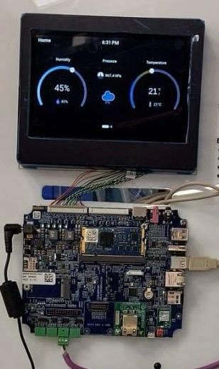

  <!-- Column 3: Image 2 -->
  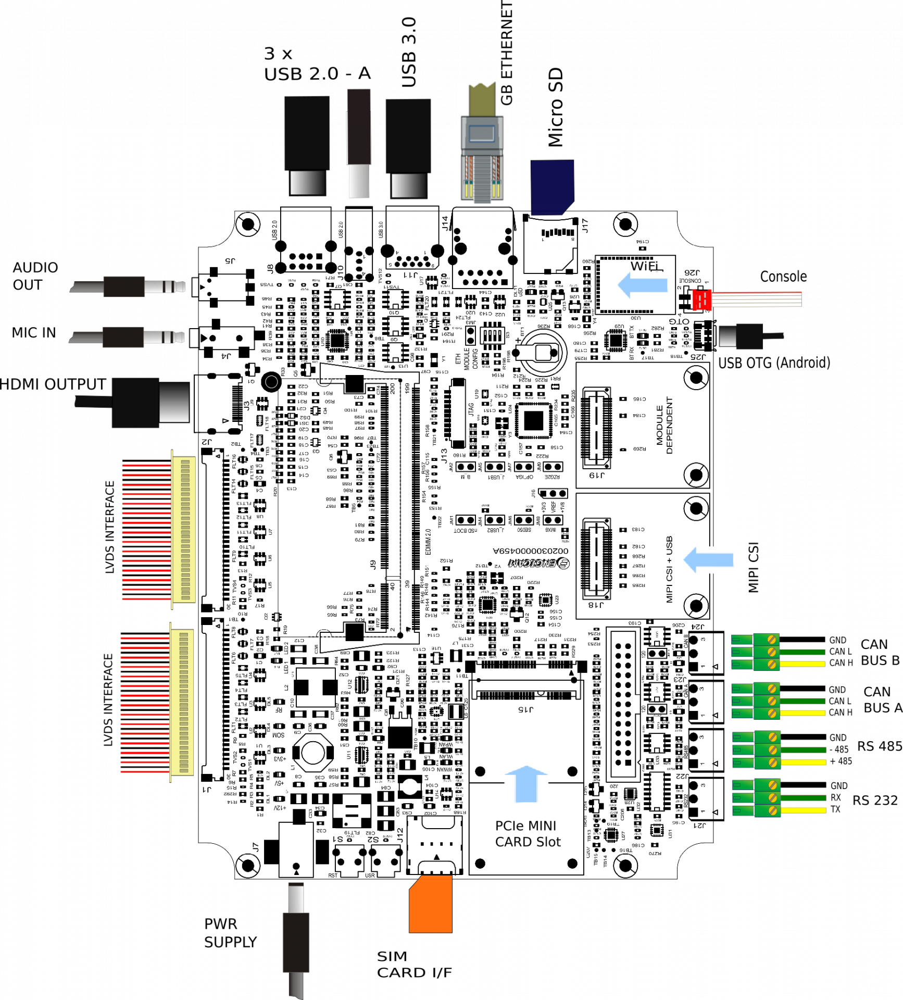
</div>

<!--
-->

---

::title::

Hardware setup - Sensor board

::body::

<div class="grid grid-cols-[1.8fr_1.2fr_1fr_0.8fr] gap-6 items-start">
  <!-- Column 1: Un-ordered list -->
  <ul class="font-bold list-disc ml-4 text-lg space-y-2">
    <li>STM32f429I-DISC1 board
      <ul class="font-normal list-disc ml-6 space-y-1">
        <li>Arm® Cortex®‑M4 MCU up to 180 Mhz</li>
        <li>2MB Flash</li>
        <li>8MB SDRAM</li>
        <li>2.4" QVGA TFT LCD</li>
        <li>2 CAN</li>
      </ul>
    </li>
    <li>LPS22HB - pressure</li>
    <li>SHT4x - temperature & humidity</li>
    <li>SN65HVD230 - CAN transceiver</li>
  </ul>

  <!-- Column 2: image -->
  <div class="flex flex-col justify-center items-center">
    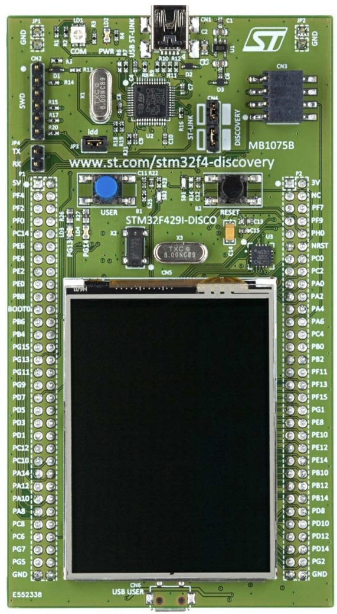
  </div>
  
  <!-- Column 3: 2 images -->
  <div class="flex flex-col gap-4">
    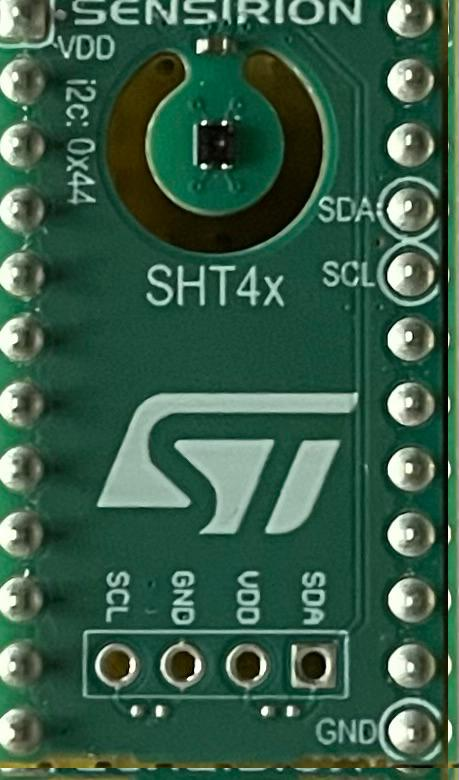
    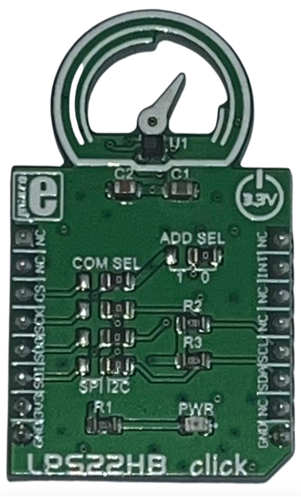
  </div>

  <!-- Column 4: yet another image -->
  <div class="flex flex-col justify-center items-center">
    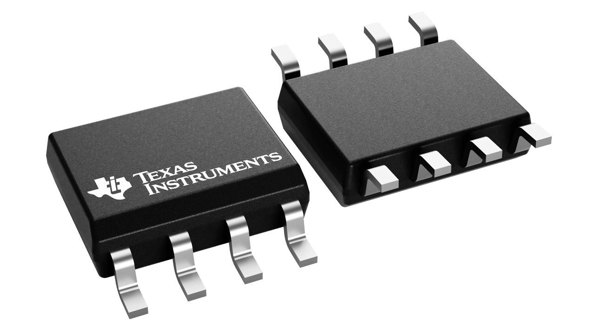
  </div>
</div>

<!--
-->

---

::title::

Hardware setup - Sensor board

::body::

<div class="grid grid-cols-3 gap-6 items-start">
  <!-- Column 1: Unordered list + image -->
  <div class="flex flex-col items-center mt-28 gap-4">
    <div class="flex flex-col justify-center">
      <ul class="font-bold list-disc ml-4 text-lg space-y-6 mt-2">
        <li>Sensors wiring to I²C bus</li>
        <li>CAN bus wiring
          <ul class="font-normal list-disc ml-6 space-y-1">
            <li>Fix USB OTG conflicts</li>
            <li>Transceiver</li>
            <li>Connector</li>
          </ul>
        </li>
      </ul>
    </div>
  <!-- Image -->
  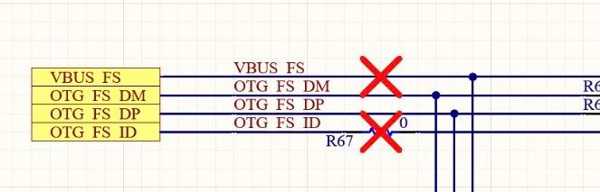

  </div>

  <!-- Column 2 -->
  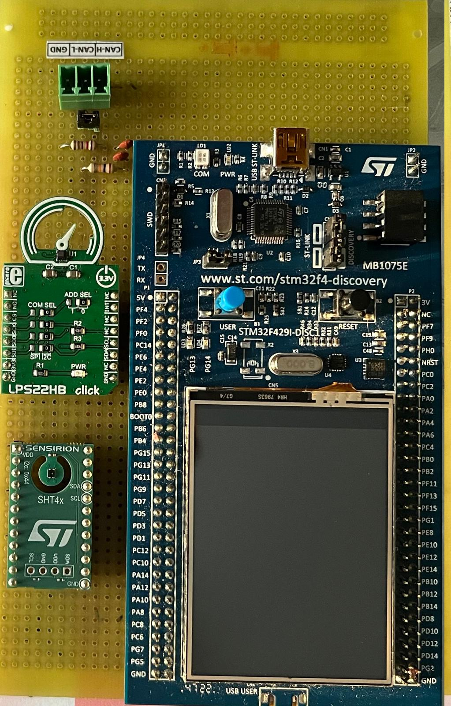

  <!-- Column 3 -->
  <div class="flex flex-col gap-4">
    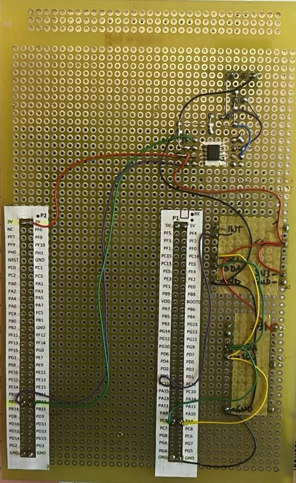
  </div>
</div>

<!--
-->

---

::title::

Yocto

::body::

<div class="flex flex-row items-center justify-center space-x-24 text-3xl">
   <div class="font-semibold max-w-xs leading-relaxed">
      Flexible, scalable and <span class="text-indigo-600 font-bold">reproducible</span>...
   </div>
    <ul class="list-disc list-inside space-y-3 max-w-xs">
       <li class="font-semibold hover:text-indigo-600 transition-colors duration-300 cursor-pointer">Customizable</li>
       <li class="font-semibold hover:text-indigo-600 transition-colors duration-300 cursor-pointer">Reproducible</li>
       <li class="font-semibold hover:text-indigo-600 transition-colors duration-300 cursor-pointer">Package-based</li>
       <li class="font-semibold hover:text-indigo-600 transition-colors duration-300 cursor-pointer">Toolchain control</li>
       <li class="font-semibold hover:text-indigo-600 transition-colors duration-300 cursor-pointer">Community-driven</li>
    </ul>
</div>

<!--
-->

---

::title::

Yocto - Layers Setup

::body::

<div class="flex flex-row items-center justify-center space-x-24 text-2xl">
   <div class="max-w-xs leading-relaxed">
      This configuration combines core OpenEmbedded layers with hardware-specific BSPs and additional functionality layers.
   </div>
   <div>
```{1|3-10|11-13|14|15-16|17}
# conf/bblayers.conf

BBLAYERS ?= " \
    ${TOPDIR}/../work/openembedded-core/meta" \
    ${TOPDIR}/../work/meta-openembedded/meta-multimedia \
    ${TOPDIR}/../work/meta-openembedded/meta-gnome \
    ${TOPDIR}/../work/meta-openembedded/meta-oe \
    ${TOPDIR}/../work/meta-openembedded/meta-networking \
    ${TOPDIR}/../work/meta-openembedded/meta-webserver \
    ${TOPDIR}/../work/meta-openembedded/meta-python \
    ${TOPDIR}/../work/meta-st-openstlinux \
    ${TOPDIR}/../work/meta-st-stm32mp \
    ${TOPDIR}/../work/meta-st-stm32mp-addons \
    ${TOPDIR}/../work/meta-engicam-st \
    ${TOPDIR}/../work/meta-clang \
    ${TOPDIR}/../work/meta-flutter \
    ${TOPDIR}/../work/meta-amarula-demo
```
   </div>
</div>

<!--
-->

---

::title::

Yocto - Challanges (WIP)

::body::

<v-switch>

  <!-- Step 0 -->
  <template #0>

  ## meta-flutter
  <br></br>
  `* bf37f37 - (HEAD -> scarthgap, origin/scarthgap) Rename CI (2 weeks ago) <Joel Winarske>`

  </template>

  <!-- Step 1 -->
  <template #1>

  ## meta-flutter
  <br></br>
  `* bf37f37 - (HEAD -> scarthgap, origin/scarthgap) Rename CI (2 weeks ago) <Joel Winarske>`

  <br></br>
  <br></br>

  ## meta-engicam-st (engicam-stable)
  <br></br>
  `* 3143970 - (HEAD -> mickledore-6.1_v24.06, origin/mickledore-6.1_v24.06) stm32mp2 MicroGEA: added support for spi1 (2 weeks ago)`

  </template>

  <!-- Step 2 -->
  <template #2>

  ## meta-flutter
  <br></br>
  `* bf37f37 - (HEAD -> scarthgap, origin/scarthgap) Rename CI (2 weeks ago) <Joel Winarske>`

  <br></br>
  <br></br>

  ## meta-engicam-st (amarula)
  <br></br>
  `* d3ff59d - (HEAD -> scarthgap, origin/scarthgap) Update conf machine configuration to use newest components (2 weeks ago) <Michael Trimarchi>`

  </template>

</v-switch>


<!--
In our project, we initially faced a version incompatibility between the official meta-engicam-st layer and the meta-flutter layer. The meta-engicam-st was based on an older Yocto release, which made it incompatible with the dependencies required by meta-flutter. To resolve this, we updated the meta-engicam-st layer to align with the latest Yocto LTS release, Scarthgap. This allowed us to successfully build both the board support package and the Flutter engine using the most recent and stable Yocto version, ensuring long-term maintainability and access to the latest features and security updates.
-->

---

::title::

Yocto - Configuration

::body::

<div class="flex flex-row items-center justify-center space-x-24 text-2xl">
   <div class="max-w-xs leading-relaxed">
      This configuration is tailored for efficient, reproducible builds and integrates
      project-specific components like.
   </div>
   <div>
````md magic-move

```
# conf/local.conf

MACHINE ??= "stm32mp25-icore"
DISTRO ??= "openstlinux-weston"
BBMULTICONFIG ?= ""

BB_NUMBER_THREADS ?= "12"
PARALLEL_MAKE ?= "-j 6"

# ST specific
EULA_FILE_ST = "1"
ACCEPT_EULA_stm32mp25-icore = "1"
GLIBC_GENERATE_LOCALES = "en_GB.UTF-8 en_US.UTF-8"
IMAGE_LINGUAS ?= "en-gb"
INHERIT += "devshell"
RM_OLD_IMAGE = "1"

# Force the usage of debian package
PACKAGE_CLASSES = "package_deb"

# Setup environment for builds binary reproducibility
REPRODUCIBLE_TIMESTAMP_ROOTFS = ""
```

```
# conf/local.conf

# Setup eSDK
SDK_EXT_TYPE="minimal"
SDK_INCLUDE_TOOLCHAIN="1"

# Enable PR server to avoid version-going-backward issue
PRSERV_HOST = "localhost:0"

# Archiver
HOSTTOOLS += "xz truncate"

# Flutter
IMAGE_INSTALL:append = " \
    flutter-engine \
    flutter-engine \
    flutter-wayland-client \
    ew-2025-flutter-demo-can-lib \
    ew-2025-flutter-demo \
    connman \
    connman-client \
"

TOOLCHAIN_HOST_TASK:append = " nativesdk-flutter-sdk"
```

````
   </div>
</div>

<!--
To ensure a smooth and consistent build process, we customised our Yocto local.conf. We optimised build performance with parallelism settings (BB_NUMBER_THREADS and PARALLEL_MAKE), and enabled STMicroelectronics-specific licensing by accepting the EULA required for STM32MP25-based platforms. For localisation, we specified UTF-8 locales and language support. We chose the Debian package format (package_deb) for improved integration with Flutter and system updates, and enabled reproducible builds by controlling root file system timestamps. The configuration also supports extensible SDK generation and sets up the PR server to prevent version rollback issues in packaged recipes. Finally, we extended the image with key components for our Flutter-based UI, including the Flutter engine, Wayland client, and our custom application demos, ensuring that everything needed for development and deployment is included out of the box.
-->

---

::title::

Yocto - KAS

::body::

<div class="flex flex-row items-center justify-center space-x-24 text-2xl">
   <div class="font-semibold max-w-xs leading-relaxed">
      This tool provides an easy mechanism to setup bitbake based projects.
   </div>
    <ul class="list-disc list-inside space-y-3 max-w-xs">
       <li class="font-semibold hover:text-indigo-600 transition-colors duration-300 cursor-pointer">Clone and checkout bitbake layers</li>
       <li class="font-semibold hover:text-indigo-600 transition-colors duration-300 cursor-pointer">Create default bitbake settings (machine, arch, …)</li>
       <li class="font-semibold hover:text-indigo-600 transition-colors duration-300 cursor-pointer">Launch minimal build environment, reducing risk of host contamination</li>
       <li class="font-semibold hover:text-indigo-600 transition-colors duration-300 cursor-pointer">Initiate bitbake build process</li>
    </ul>
</div>

<!--
As you have seen until now, managing Yocto can be tricky. Layers, configs, dependencies…

KAS make it too easy, almost boring…

KAS is a tool that simplifies working with the Yocto Project by managing configurations and build environments through a single YAML file. Instead of manually setting up multiple layers, repositories, and local configurations, KAS lets you define everything in a structured, version-controlled format, making your builds reproducible and team-friendly. With just one command, kas build, you can go from a clean environment to a fully built Linux image. It's especially useful in collaborative or CI/CD setups, where consistency and ease of setup are crucial. Think of it as a lightweight project manager that keeps your Yocto-based workflows clean, reliable, and repeatable.

With the power of Yocto and the simplicity of KAS, our result is this YAML file that contains all the building blocks that we analysed earlier.
-->

---

::title::

Yocto - KAS config

::body::

<div class="flex flex-row items-center justify-center space-x-24 text-2xl">
   <div class="max-w-xs leading-relaxed">
      A single YAML file that defines both layers and build configuration, making the Yocto setup reproducible, portable, and easy to manage.
   </div>
   <div>
````md magic-move

```{1|3-6|7-23}
# .config.yaml

machine: stm32mp25-icore
distro: openstlinux-weston
target: st-image-weston

repos:
    bitbake:
        url: "https://git.openembedded.org/bitbake"
        branch: "2.10"
        layers:
            .: excluded

    openembedded-core:
        url: "https://git.openembedded.org/openembedded-core"
        commit: 236ac1b43308df722a78d3aa20aef065dfae5b2b
        layers:
            meta:

[...]
```

```
[...]

local_conf_header:
    standard: |
        BB_NUMBER_THREADS ?= "12"
        PARALLEL_MAKE ?= "-j 6"
        EULA_FILE_ST = "1"
        ACCEPT_EULA_stm32mp25-icore = "1"
        GLIBC_GENERATE_LOCALES = "en_GB.UTF-8 en_US.UTF-8"
        IMAGE_LINGUAS ?= "en-gb"
        INHERIT += "devshell"
        RM_OLD_IMAGE = "1"
        PACKAGE_CLASSES = "package_deb"
        REPRODUCIBLE_TIMESTAMP_ROOTFS = ""
        SDK_EXT_TYPE="minimal"
        SDK_INCLUDE_TOOLCHAIN="1"
        PRSERV_HOST = "localhost:0"
        HOSTTOOLS += "xz truncate"
        IMAGE_INSTALL:append = " \
            flutter-engine \
            flutter-wayland-client \
            ew-2025-flutter-demo-can-lib \
            ew-2025-flutter-demo \
            connman \
            connman-client \
        "
        TOOLCHAIN_HOST_TASK:append = " nativesdk-flutter-sdk"
```

````
   </div>
</div>

<!--
-->

---

<style scoped>
.slidev-code {
   font-size: 24px !important;
   line-height: 36px !important;
}
</style>

::title::

Yocto - KAS Usage

::body::

<div class="flex flex-col item-center justify-left text-2xl">
   <div class="font-semibold leading-relaxed">
      Run KAS on host
   </div>
   <div>
```bash
   $ kas checkout
   $ kas build
```
   </div>
   <br>
   <div class="font-semibold leading-relaxed">
      Run KAS inside a build container
   </div>
   <div>
```bash
  $ kas-container checkout
  $ kas-container build
```
   </div>
</div>

<!--
-->

---

::title::

Flutter

::body::

<div class="flex flex-row justify-evenly w-full text-3xl font-semibold leading-relaxed p-8">
   <div class="flex items-center justify-center">
      <div class="bg-white rounded-lg shadow-lg overflow-hidden hover:shadow-xl transition-shadow w-64">
         
         <div class="p-2 text-center text-sm font-medium text-gray-700">Made by Google</div>
      </div>
   </div>
   <div class="grid grid-cols-2 gap-6">
      <div class="bg-white rounded-lg shadow-lg overflow-hidden hover:shadow-xl transition-shadow">
         
         <div class="p-2 text-center text-sm font-medium text-gray-700">Mobile</div>
      </div>
      <div class="bg-white rounded-lg shadow-lg overflow-hidden hover:shadow-xl transition-shadow">
         
         <div class="p-2 text-center text-sm font-medium text-gray-700">Web</div>
      </div>
      <div class="bg-white rounded-lg shadow-lg overflow-hidden hover:shadow-xl transition-shadow">
         
         <div class="p-2 text-center text-sm font-medium text-gray-700">Desktop</div>
      </div>
      <div class="bg-white rounded-lg shadow-lg overflow-hidden hover:shadow-xl transition-shadow">
         
         <div class="p-2 text-center text-sm font-medium text-gray-700">Embedded</div>
      </div>
   </div>
</div>

<!--
We just seen how LVGL was really suited for our needs and the potential that it offers on MCUs. But what about MPUs?

For those who don’t know Flutter is a UI framework developed by Google and written in the Dart language. It’s extremely popular in the mobile app world.

Now, you might be thinking, 'Flutter? That's for mobile apps.' I’ve heard people say it’s not truly supported on embedded Linux. Today, we're going to bust that myth. Not only is it supported, but it's already shipping in real products from major brands like Toyota.
-->

---

::title::

Flutter - Power

::body::

<div class="flex flex-row items-center justify-center space-x-24 text-2xl">
   <div class="font-semibold max-w-xs leading-relaxed">
      This framework's developer experience and power are top-notch.
   </div>
      <ul class="list-disc list-inside space-y-3 max-w-xs text-xl">
         <li class="font-semibold hover:text-indigo-600 transition-colors duration-300 cursor-pointer">
            Easy to learn and use
         </li>
         <li class="font-semibold hover:text-indigo-600 transition-colors duration-300 cursor-pointer">
            Hot Reload
         </li>
         <li class="font-semibold hover:text-indigo-600 transition-colors duration-300 cursor-pointer">
            Null safety and async/await support
         </li>
         <li class="font-semibold hover:text-indigo-600 transition-colors duration-300 cursor-pointer">
            Natively compiled for great performance
         </li>
         <li class="font-semibold hover:text-indigo-600 transition-colors duration-300 cursor-pointer">
            Cross-platform with consistent UI
         </li>
         <li class="font-semibold hover:text-indigo-600 transition-colors duration-300 cursor-pointer">
            Excellent tooling for development and debugging
         </li>
      </ul>
</div>

<!--
-->

---

::title::

Flutter - Ecosystem

::body::

<div class="flex flex-row items-center justify-center space-x-24 text-2xl">
  <div class="flex flex-col items-center justify-center space-y-4">
    <div class="bg-white rounded-lg shadow-lg overflow-hidden hover:shadow-xl transition-shadow w-54">
      
    </div>
    <div class="bg-white rounded-lg shadow-lg overflow-hidden hover:shadow-xl transition-shadow w-54">
      
    </div>
  </div>
    <ul class="list-disc list-inside space-y-3 max-w-xs text-2xl">
      <li>
        <a href="https://pub.dev/packages/get" class="text-blue-500 underline">
          get
        </a>
      </li>
      <li>
        <a href="https://pub.dev/packages/fl_chart" class="text-blue-500 underline">
          fl_chart
        </a>
      </li>
      <li>
        <a href="https://pub.dev/packages/google_fonts" class="text-blue-500 underline">
          google_fonts
        </a>
      </li>
      <li>
        <a href="https://pub.dev/packages/animations" class="text-blue-500 underline">
          animations
        </a>
      </li>
      <li>
        <a href="https://github.com/amarula/flutekeyboard" class="text-blue-500 underline">
          flutekeyboard
        </a>
      </li>
    </ul>
</div>

<!--
-->

---

::title::

Flutter - C++

::body::

<div class="flex flex-row items-center justify-evenly text-2xl">
   <div class="font-semibold max-w-xs leading-relaxed">
      Flutter apps can use the FFI library to call native C APIs, and to read, write, allocate, and deallocate native memory.
   </div>
   <div class="flex flex-col space-y-16">
      <div>
```cpp
static double k_temperature = 1;

EXPORT double get_temperature() { return k_temperature; }
```
            </div>
            <div>
```dart
final lib = DynamicLibrary.open(libraryPath);

final getTemperature = lib
    .lookup<NativeFunction<DoubleFuncCpp>>('get_temperature')
    .asFunction<DoubleFunc>();

double _temperature = getTemperature();
```
      </div>
   </div>
</div>

<!--
-->

---

::title::

Flutter - Yocto

::body::

<v-switch>
   <template #0>
      <div class="flex flex-row items-center space-x-6 justify-evenly text-2xl">
         <div class="font-semibold max-w-xs leading-relaxed">
            Yocto     <a href="https://github.com/meta-flutter/meta-flutter" class="text-blue-500">
      meta-flutter
    </a>
         </div>
         <div class="flex flex-col items-center space-y-16 max-w-xs leading-relaxed">
          <div>Flutter SDK</div>
          <div class="max-w-2xl leading-relaxed">
            Add to local.conf file:

```
TOOLCHAIN_HOST_TASK:append = " nativesdk-flutter-sdk"
```

Then run:

```
bitbake <image name> -c populate_sdk
```
          </div>
         </div>
      </div>
   </template>
   <template #1>
      <div class="flex flex-row items-center space-x-6 justify-evenly text-2xl">
         <div class="font-semibold max-w-xs leading-relaxed">
            Yocto     <a href="https://github.com/meta-flutter/meta-flutter" class="text-blue-500">
      meta-flutter
    </a>
         </div>
         <div class="flex flex-col items-center space-y-16">
          <div>Flutter Engine</div>
          <div class="max-w-2xl leading-relaxed">
The Flutter Engine is a low-level runtime that provides the core functionality for Flutter applications
          </div>
         </div>
      </div>
   </template>
      <template #2>
      <div class="flex flex-row items-center space-x-6 justify-evenly text-2xl">
         <div class="font-semibold max-w-xs leading-relaxed">
            Yocto     <a href="https://github.com/meta-flutter/meta-flutter" class="text-blue-500">
      meta-flutter
    </a>
         </div>
         <div class="flex flex-col items-center space-y-6">
          <div>Flutter Embedders</div>
          <div class="max-w-2xl leading-relaxed  text-lg">
An embedder is the platform-specific code that integrates the Flutter engine with the device's operating system, graphics stack, input system, and other low-level services.
          </div>
          <ul class="list-disc list-inside space-y-2 max-w-xs  text-lg">
            <li>flutter-pi</li>
            <li>flutter-wayland-client</li>
            <li>ivi-homescreen</li>
          </ul>
         </div>
      </div>
   </template>
      <template #3>
      <div class="flex flex-row items-center space-x-24 justify-evenly text-2xl">
         <div class="font-semibold max-w-xs leading-relaxed">
            Yocto     <a href="https://github.com/meta-flutter/meta-flutter" class="text-blue-500">
      meta-flutter
    </a>
         </div>
         <div class="flex flex-col items-center space-y-6">
          <div>Flutter App Recipe</div>
          <div class="max-w-2xl leading-relaxed  text-lg">
```{14}
SRCREV = "${AUTOREV}"
SRC_URI = " \
    git://github.com/amarula/ew_2025_flutter_demo.git;branch=main;protocol=https;destsuffix=git \
    file://ew-2025-flutter-demo \
    file://ew-2025-flutter-demo.service \
    "

S = "${WORKDIR}/git"

PUBSPEC_APPNAME = "ew_2025_flutter_demo"
FLUTTER_APPLICATION_INSTALL_SUFFIX = "ew_2025_flutter_demo"
FLUTTER_APPLICATION_PATH = ""

inherit flutter-app

inherit systemd
SYSTEMD_PACKAGES += " ${PN} "
SYSTEMD_SERVICE:${PN} = "ew-2025-flutter-demo.service"
SYSTEMD_AUTO_ENABLE:${PN} = "enable"
```
          </div>
         </div>
      </div>
   </template>
</v-switch>

<!--
-->

---

::title::

Zephyr

::body::

<div class="mt-0 flex space-x-24 w-full">

  <!-- left column: logo -->
  <div class="flex-1 flex items-center justify-center">
    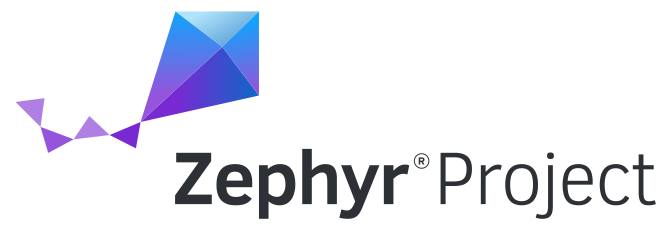
  </div>

  <ul class="flex-1 list-disc list-inside space-y-1 text-xl font-semibold">
    <li> Open source RTOS </li>
    <li> Low memory footprint </li>
    <li> High portability - 500+ boards </li>
    <li> LTS support </li>
    <li> Linux like - Kconfig & Devicetree </li>
    <li>
      Ecosystem - not only the kernel
      <ul class="list-disc ml-6 font-normal space-y-1">
        <li>Developing tools - west</li>
        <li>Device drivers</li>
        <li>Connectivity</li>
        <li>Much more</li>
      </ul>
    </li>
  </ul>

</div>

<!--
-->

---

::title::

Zephyr - Application

::body::

<div class="mt-0">
<div grid="~ cols-2 gap-4">

<div>

<ul class="font-bold">
  <li>
    Build system
    <ul class="font-normal">
      <li> Based on CMake</li>
      <li> Application centric</li>
    </ul>
  </li>
  <li>
    Application directory
    <ul class="font-normal">
      <li>
        CMakeLists.txt
	<li> Where to find application files - src/*.c </li>
	<li> Link application to the Zephyr’s build system </li>
      </li>
      <li>
        app.overlay
	<li> Devicetree changes </li>
	<li> Apply to the Zephyr devicetree board </li>
	<li class="text-red-600"> Turn STM32F429I-DISC1 into sensor board</li>
      </li>
      <li>
        prj.conf
	<li> Kconfig fragment </li>
	<li> Merge with Zephyr configuration</li>
      </li>
    </ul>
  </li>
</ul>

</div>

<div>

```
<app>
├── CMakeLists.txt
├── app.overlay
├── prj.conf
└── src
    └── *.c
```

</div>

</div>
</div>

<!--
-->

---

::title::

Zephyr - Application types

::body::

<div grid="~ cols-2 gap-4">

<div>

<ul class="font-bold">
  <li> Zephyr repository application </li>
  <li class="text-red-600">
    Zephyr workspace application
    <ul class="font-normal text-black">
      <li> Avoid unnecessary changes to Zephyr repo</li>
      <li>
        Use a
        <a href="https://github.com/zephyrproject-rtos/example-application" class="text-blue-500 underline">
          reference
        </a>
        workspace application
      </li>
    </ul>
  </li>
  <li> Zephyr freestanding application </li>
</ul>

```
# Zephyr workspace application for sensor board

$ source ~/zephyrproject/.venv/bin/activate
$ west init -m https://github.com/amarula/ew_lvgl_demo --mr main \
     	  ew_lvgl_demo_workspace
$ cd ew_lvgl_demo_workspace
$ west update
$ tree
├── ew_lvgl_demo
|   └── app
├── modules
|   ├── hal
|   │   └── stm32
|   └── lib
|       └── gui
|           └── lvgl
└── zephyr

```

</div>

<div>

```
# Zephyr repository application

zephyrproject/
└─── zephyr/
     ├── ...
     └── samples/
         └── app/
```

```
# Zephyr workspace application

zephyrproject/
├─── zephyr/
├─── ...
└─── applications/
     └── app/
```

```
# Zephyr freestanding application

<home>/
├─── zephyrproject/
│     ├─── .west/
│     │    └─── config
│     ├── zephyr/
│     └── ...
│
└─── app/
```

</div>

</div>

<!--
-->

---

::title::

Zephyr - CMakeLists.txt

::body::

<div grid="~ cols-2 gap-4">
<div class="flex items-center">

<ul class="font-bold space-y-16">
  <li>
    find_package()
    <ul class="font-normal">
      <li>
        Pull in the Zephyr build system
	<ul class="font-normal">
	  <li> Create a CMake target named app</li>
	</ul>
      </li>
      <li> $ENV{ZEPHYR_BASE} set by west build command</li>
    </ul>
  </li>
  <li>
    target_sources()
    <ul class="font-normal">
      <li> Add application sources to the app target</li>
    </ul>
  </li>
</ul>


</div>

<div>

```
# app/CMakeLists.txt

cmake_minimum_required(VERSION 3.13)

find_package(Zephyr REQUIRED HINTS $ENV{ZEPHYR_BASE})

project(Amarula-Demo VERSION 0.1.0 LANGUAGES C)

target_sources(app
               PRIVATE src/main.c
               src/lvgl_gui.h
               src/lvgl_gui.c
               resources/temperature.c
               resources/humidity.c
               resources/pressure.c
               resources/mono_font.c
               src/led.h
               src/led.c
               src/can.h
               src/can.c)
```

</div>

</div>

<!--
ts {5|9-20|all}
-->

---

::title::

Zephyr - app.overlay

::body::

<div grid="~ cols-2 gap-4">
<div class="flex items-center">

<ul class="font-bold space-y-4">
<li> Extend the STM32F429I-DISC1 board </li>
<li> Align with hardware changes </li>
<li> Populate the i2c3 bus
<ul class="font-normal">
<li> Temperature & himudity sensor @ 0x44 </li>
<li> Pressure sensor @ 0x5c </li>
</ul>
</li>
<li> Enable CAN controller
<ul class="font-normal">
<li> Disable USB OTG - pins shared </li>
<li> No transceiver description </li>
</ul>
</li>
</ul>
</div>

<div>

```
# app/boards/stm32f429i_disc1.overlay

&i2c3 {
	sht4x@44 {
		compatible = "sensirion,sht4x";
		status = "okay";
		reg = <0x44>;
		repeatability = <2>;
	};

	lps22hb@5c {
		compatible = "st,lps22hb-press";
		status = "okay";
		reg = <0x5c>;
	};
};

zephyr_udc0: &usbotg_hs {
	status = "disabled";
};

&can2 {
	pinctrl-0 = <&can2_rx_pb12 &can2_tx_pb13>;
	pinctrl-names = "default";
	status = "okay";
};
```

</div>

</div>

<!--
-->

---

::title::

Zephyr - prj.conf

::body::

<div grid="~ cols-2 gap-4">
<div class="flex items-center">

<ul class="font-bold space-y-6">
  <li>I2C bus</li>
  <li>Sensor</li>
  <li>CAN bus</li>
  <li>LED</li>
  <li>Graphical library</li>
</ul>

</div>

<div>

```
# app/prj.conf

CONFIG_LOG=y
CONFIG_SHELL=y

CONFIG_I2C=y
CONFIG_SENSOR=y

CONFIG_CAN=y

CONFIG_LED=y

CONFIG_DISPLAY=y

CONFIG_LVGL=y
CONFIG_LV_USE_LABEL=y
CONFIG_LV_USE_BTN=y
CONFIG_LV_...=y
```

</div>

</div>

<!--
-->

---

::title::

Zephyr - app/*.c

::body::

<div grid="~ cols-2 gap-4">
<div class="flex items-center">

<ul class="font-bold space-y-3">
  <li> Clear API provided by Zephyr and its module </li>
  <li> Lot of application examples
    <ul class="font-normal text-black">
      <li> samples/drivers/display </li>
      <li> samples/subsys/display/lvgl </li>
      <li> samples/net/sockets/can </li>
    </ul>
  </li>
</ul>

</div>

<div class="text-center">
    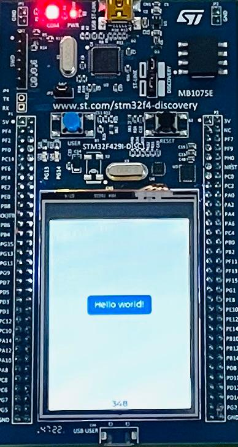
</div>

</div>

<div class="mt-2">

```
$ source ~/zephyrproject/.venv/bin/activate
$ cd ~/zephyrproject/zephyr

$ west build --pristine -b stm32f429i_disc1 samples/drivers/display
$ west flash --runner openocd --config ${HOME}/zephyr-sdk-0.17.0/sysroots/x86_64-pokysdk-linux/usr/share/openocd/scripts/board/stm32f429disc1.cfg

$ west build --pristine -b stm32f429i_disc1 samples/subsys/display/lvgl
$ west flash --runner openocd --config ${HOME}/zephyr-sdk-0.17.0/sysroots/x86_64-pokysdk-linux/usr/share/openocd/scripts/board/stm32f429disc1.cfg

# change boards/st/stm32f429i_disc1/stm32f429i_disc1.dts to enable CAN2 controller
$ west build --pristine -b stm32f429i_disc1 samples/net/sockets/can/
$ west flash --runner openocd --config ${HOME}/zephyr-sdk-0.17.0/sysroots/x86_64-pokysdk-linux/usr/share/openocd/scripts/board/stm32f429disc1.cfg
```

</div>

<!--
-->

---

::title::

Zephyr - FOSS contribute

::body::

<div grid="~ cols-2 gap-4">
<div class="flex items-center">
    <ul class="font-bold space-y-4">
      <li>
        Devicetree
        <ul class="font-normal text-black">
          <li> 2 bxCAN controllers on STM32F429 MCU </li>
          <li> They share RAM (512 bytes) and filters </li>
	  <li> CAN1 primary controller </li>
	  <li> CAN2 secondary controller </li>
          <li> Enable CAN1 RCC clock to use CAN2</li>
	  <li> Need to fix a regression by code re-factoring</li>
	  <li>
	    bxCAN internals? Don’t miss Amarula's
            <a href="https://archive.fosdem.org/2024/schedule/event/fosdem-2024-2864-linux-can-upstreaming-on-mmu-less-systems" class="text-blue-500 underline" target="_blank">
              talk
	    </a>
	    at FOSDEM 2024
	  </li>
        </ul>
      </li>
      <li>
        Documentation
        <ul class="font-normal text-black">
          <li> Fix flashing section </li>
          <li> LTDC hardware now supported </li>
        </ul>
      </li>
    </ul>
  </div>

<div>

```
/ {
	chosen {
		zephyr,canbus = &can2;
	};

	soc {
		can2: can@40006800 {
		        clocks = <&rcc STM32_CLOCK_BUS_APB1 0x06000000>;
		};
	};
};
```

```
~/zephyrproject/zephyr$ git log --oneline --author="Dario Binacchi"
2c3294b079cf dts: arm: st: re-enable master can gating clock for can2
ed48de2583af boards: st: stm32f429i_disc1: doc: re-work flashing section
3f6978e913ff boards: st: stm32f429i_disc1: doc: support LTDC hardware
7bca40cceda4 boards: st: stm32f429i_disc1: doc: fix flashing info
```
</div>

</div>

<!--
-->

---

::title::

LVGL

::body::


<div class="flex flex-row items-center justify-center space-x-24 text-2xl">
   <div class="font-semibold max-w-xs leading-relaxed">
      
      Light and Versatile Graphics Library
   </div>
   <div>
      <ul class="text-xl list-disc list-inside space-y-3 max-w-xs">
         <li class="font-semibold hover:text-indigo-600 transition-colors duration-300 cursor-pointer">Open source</li>
	 <li class="font-semibold hover:text-indigo-600 transition-colors duration-300 cursor-pointer">Written in C</li>
         <li class="font-semibold hover:text-indigo-600 transition-colors duration-300 cursor-pointer">Low memory footprint</li>
         <li class="font-semibold hover:text-indigo-600 transition-colors duration-300 cursor-pointer">Wide range of widgets</li>
         <li class="font-semibold hover:text-indigo-600 transition-colors duration-300 cursor-pointer">Support input devices</li>
	 <li class="font-semibold hover:text-indigo-600 transition-colors duration-300 cursor-pointer">Zephyr packaged with LVGL</li>
      </ul>
    </div>
</div>

<!--
-->

---

::title::

LVGL - Zephyr integration

::body::

<div grid="~ cols-2 gap-4">
<div class="flex items-center">

<ul class="font-bold space-y-10">
  <li>
    modules/lib/gui/lvgl/
    <ul class="font-normal">
      <li>LVGL codebase</li>
      <li>west update</li>
      <li>Version in lvgl.h - 8.4.0</li>
    </ul>
  </li>
  <li>
    zephyr/modules/gui/lvgl
    <ul class="font-normal">
      <li>Zephyr Kconfig options</li>
      <li>Zephyr glue code
        <li>DT_CHOSEN(zephyr_display)</li>
        <li>SYS_INIT(lvgl_init, APPLICATION, ...)</li>
      </li>
    </ul>
  </li>
</ul>
</div>

<div>
```
~zephyrprojects/
 ├── modules
 │   └── lib
 │       └── gui
 │           └── lvgl
 └── zephyr
     └── modules
         └── lvgl

```

```
int lvgl_init(void)
{
	for (int i = 0; i < DT_ZEPHYR_DISPLAYS_COUNT; i++) {
		if (!device_is_ready(display_dev[i])) {
			LOG_ERR("Display device %d is not ready", i);
			return -ENODEV;
		}
	}

	for (int i = 0; i < DT_ZEPHYR_DISPLAYS_COUNT; i++) {
		err = lvgl_allocate_rendering_buffers(lv_displays[i]);
	}

	err = lvgl_init_input_devices();
}

```
</div>

</div>

<!--
-->

---

::title::

LVGL - Display Kconfig

::body::

<div grid="~ cols-2 gap-4">
<div class="flex items-center">

<ul class="font-bold space-y-24">
<li> Display subsystem </li>
<li>
Display driver
<ul class="font-normal">
<li> ILI9341 from Ilitek</li>
</ul>
</li>

</ul>

</div>

<div>

```
# app/prj.conf

CONFIG_DISPLAY=y
```

```
# drivers/display/Kconfig.ili9xxx

config ILI9341
	bool "ILI9341 display driver"
	default y
	depends on DT_HAS_ILITEK_ILI9341_ENABLED
	select MIPI_DBI
	select ILI9XXX
	help
	  Enable driver for ILI9341 display driver.
```

```
# boards/st/stm32f429i_disc1/stm32f429i_disc1.dts

ili9341: ili9341@0 {
	 compatible = "ilitek,ili9341";
	 ...
    }
```

```
# build/zephyr/.config

CONFIG_ILI9341=y
```
</div>

</div>

<!--
-->

---

::title::

LVGL - Display DTS

::body::

<div grid="~ cols-2 gap-4">
<div class="flex items-center">

<ul class="font-bold space-y-4">
<li> zephyr,display property </li>
<li> zephyr,lvgl-pointer-input compatible </li>
<li>
lvgl_init()
<ul class="font-normal">
<li> Just before the application code (main)</li>
<li> Turn on display</li>
<li> Turn on input devices - touchscreen, mouse, ... </li>
</ul>
</li>
<li> Hardware independent application code </li>
</ul>
</div>

<div>

```
# boards/st/stm32f429i_disc1/stm32f429i_disc1.dts

chosen {
	...
	zephyr,display = &ltdc;
	zephyr,touch = &stmpe811;
};

lvgl_pointer {
	compatible = "zephyr,lvgl-pointer-input";
	input = <&stmpe811>;
};
```

```
# modules/lvgl/lvgl.c

SYS_INIT(lvgl_init, APPLICATION, CONFIG_LV_Z_INIT_PRIORITY);
```

```
$ west build -t initlevels
EARLY ...
PRE_KERNEL_1 ...
PRE_KERNEL_2 ...
POST_KERNEL ...
 __init___device_dts_ord_99: ili9xxx_init(__device_dts_ord_99)
 __init___device_dts_ord_122: stm32_ltdc_init(__device_dts_ord_122)
 __init___device_dts_ord_16: stmpe811_init(__device_dts_ord_16)
APPLICATION
 __init_lvgl_init: lvgl_init(NULL)
SMP
```

</div>

</div>

<!--
-->

---

::title::

LVGL - Library Kconfig

::body::

<div grid="~ cols-2 gap-4">
<div>

<ul class="font-bold mt-4 space-y-12">
<li> Enable LVGL </li>
<li> Enable only the used widgets </li>
<li> Fine-tune the application footprint </li>
</ul>
</div>

```
# app/prj.cof

CONFIG_LVGL=y

CONFIG_LV_Z_MEM_POOL_SIZE=16384
CONFIG_LV_Z_SHELL=y
CONFIG_LV_MEM_CUSTOM=y

CONFIG_LV_USE_LABEL=y
CONFIG_LV_USE_BTN=y
CONFIG_LV_USE_ARC=y
CONFIG_LV_USE_IMG=y
CONFIG_LV_FONT_MONTSERRAT_16=y
CONFIG_LV_FONT_MONTSERRAT_32=y

```
</div>

<!--
-->

---

::title::

LVGL - Application

::body::

<div grid="~ cols-2 gap-4">
<div class="flex items-center">

<ul class="font-bold space-y-4">
<li>
In LVGL Everything is an object
<ul class="font-normal">
<li> Create the object </li>
<li> Setup its properties </li>
<li> Place on the screen </li>
</ul>
</li>
<li>
  Start from the
  <a href="https://docs.lvgl.io/master/intro/getting_started/learn_the_basics.html" class="text-blue-500 underline">
    basic data flow
  </a>
<ul class="list-decimal">
<li class="text-blue-400"> Driver initialization - Zephyr </li>
<li class="text-blue-400"> Run lvgl_init() - Zephyr </li>
<li class="text-blue-400"> Create display and input devices - Zephyr </li>
<li> Create GUI </li>
<li> Read data from sensors </li>
<li> Update widgets properties </li>
<li> Refresh the screen </li>
</ul>
</li>

</ul>

</div>

<div>

```
/* Create a white label, set its text and align it to the center */
lv_obj_t * label = lv_label_create(lv_screen_active());
lv_label_set_text(label, "Hello world");
lv_obj_set_style_text_color(lv_screen_active(), lv_color_hex(0xffffff),
							LV_PART_MAIN);
lv_obj_align(label, LV_ALIGN_CENTER, 0, 0);
```

```
void main(void) {

     struct sensor_value temp;
     const struct device *const sht =
     	   	  DEVICE_DT_GET_ANY(sensirion_sht4x);

     gui_init();

     for (;;) {
	      sensor_channel_get(sht, SENSOR_CHAN_AMBIENT_TEMP, &sv_temp);

	      gui_set_temperature(temp);

	      lv_timer_handler();
	      k_sleep(K_MSEC(5));
     }
}
```
</div>

</div>

<!--
-->

---

::title::

Acknowledgements

::body::

<div class="mt-0">
This talk was made possible thanks to the help and encouragement of many
people.
</div>

<div class="mt-6">
A special thanks to Alberto Bianchi for the designing and building the hardware,<br>
Michael Trimarchi for the Yocto operating system integration, and Eduardo Gonzalez<br>
for developing the application on the sensor board.
</div>

<div class="mt-6">
Thanks to Benjamin Cabé, Erwan Gouriou, Marwa, Henrik Brix Andersen, Mathieu CHOPLAIN<br>
and Abderrahmane Jarmouni for the review and acceptance of the Zephyr project patches.
</div>

<div class="mt-6">
Thanks to Alberto Panizzo, Michael Trimarchi and Vera Binacchi for the slides review<br>
and refinement.
</div>

<div class="mt-6">
Thanks to Amarula and ELCE organization for the assistance and support.
</div>

<div class="mt-18">
We are sorry If we forgot someone :).
</div>

<!--
-->

---

::title::

Resources

::body::

<div class="mt-3 text-xl">
Flutter
<div class="ml-3 text-sm">
  <a href="https://github.com/meta-flutter/meta-flutter" class="text-blue-500 underline">
    https://github.com/meta-flutter/meta-flutter
  </a><br>
  <a href="https://flutter.dev" class="text-blue-500 underline">
    https://flutter.dev
  </a><br>
  <a href="https://pub.dev" class="text-blue-500 underline">
    https://pub.dev
  </a>
</div>
</div>

<div class="mt-3 text-xl">
Hands-on
<div class="ml-3 text-sm">
  <a href="https://github.com/amarula/ew_2025_flutter_demo" class="text-blue-500 underline">
    https://github.com/amarula/ew_2025_flutter_demo
  </a><br>
  <a href="https://github.com/amarula/ew_2025_lvgl_demo" class="text-blue-500 underline">
    https://github.com/amarula/ew_2025_lvgl_demo
  </a><br>
  <a href="https://github.com/amarula/meta-engicam-st" class="text-blue-500 underline">
    https://github.com/amarula/meta-engicam-st
  </a><br>
  <a href="https://github.com/amarula/meta-amarula-demo" class="text-blue-500 underline">
    https://github.com/amarula/meta-amarula-demo
  </a>
</div>
</div>

<div class="mt-3 text-xl">
Hardware
<div class="ml-3 text-sm">
  <a href="https://www.st.com/en/microcontrollers-microprocessors/stm32mp257.html" class="text-blue-500 underline">
    https://www.st.com/en/microcontrollers-microprocessors/stm32mp257.html
  </a><br>
  <a href="https://www.engicam.com/vis-prod/101366/EDIMM-2-0-STARTER-KIT-EDIMM-2-0-Form-Factor-Capacitive-Evaluation-Board" class="text-blue-500 underline">
    https://www.engicam.com/vis-prod/101366/EDIMM-2-0-STARTER-KIT-EDIMM-2-0-Form-Factor-Capacitive-Evaluation-Board
  </a><br>
  <a href="https://www.st.com/en/microcontrollers-microprocessors/stm32f429-439.html" class="text-blue-500 underline">
    https://www.st.com/en/microcontrollers-microprocessors/stm32f429-439.html
  </a><br>
  <a href="https://www.st.com/en/evaluation-tools/32f429idiscovery.html" class="text-blue-500 underline">
    https://www.st.com/en/evaluation-tools/32f429idiscovery.html
  </a><br>
  <a href="https://community.st.com/ysqtg83639/attachments/ysqtg83639/mcu-touch-gfx-gui-forum/1401/1/FRIDA_LCD_FRD240C48003-B.pdf" class="text-blue-500 underline">
    https://community.st.com/ysqtg83639/attachments/ysqtg83639/mcu-touch-gfx-gui-forum/1401/1/FRIDA_LCD_FRD240C48003-B.pdf
  </a><br>
  <a href="https://www.mikroe.com/lps22hb-click?srsltid=AfmBOoqLNTD-FiAuQrsgVKIiQ03Lkr36fZFyAKXXYfBffaFiuQxTN0Ok" class="text-blue-500 underline">
    https://www.mikroe.com/lps22hb-click?srsltid=AfmBOoqLNTD-FiAuQrsgVKIiQ03Lkr36fZFyAKXXYfBffaFiuQxTN0Ok
  </a><br>
  <a href="https://sensirion.com/products/catalog/SENSEVAL-SHT4XV1" class="text-blue-500 underline">
    https://sensirion.com/products/catalog/SENSEVAL-SHT4XV1
  </a><br>
    <a href="https://www.ti.com/lit/ds/symlink/sn65hvd230.pdf?ts=1752742041247&ref_url=https%253A%252F%252Fwww.google.com%252F" class="text-blue-500 underline">
    https://www.ti.com/lit/ds/symlink/sn65hvd230.pdf?ts=1752742041247&ref_url=https%253A%252F%252Fwww.google.com%252F
  </a><br>
    <a href="https://archive.fosdem.org/2024/schedule/event/fosdem-2024-2864-linux-can-upstreaming-on-mmu-less-systems" class="text-blue-500 underline">
    https://archive.fosdem.org/2024/schedule/event/fosdem-2024-2864-linux-can-upstreaming-on-mmu-less-systems
  </a>
</div>
</div>

<!--
-->

---

::title::

Resources

::body::

<div class="mt-3 text-xl">
LVGL
<div class="ml-3 text-sm">
  <a href="https://docs.lvgl.io/master/index.html" class="text-blue-500 underline">
    https://docs.lvgl.io/master/index.html
  </a><br>
  <a href="https://docs.lvgl.io/master/intro/getting_started/learn_the_basics.html" class="text-blue-500 underline">
    https://docs.lvgl.io/master/intro/getting_started/learn_the_basics.html
  </a><br>
  <a href="https://docs.lvgl.io/master/details/integration/os/zephyr.html" class="text-blue-500 underline">
    https://docs.lvgl.io/master/details/integration/os/zephyr.html
  </a><br>
  <a href="https://docs.lvgl.io/master/intro/getting_started/learn_the_basics.html" class="text-blue-500 underline">
    https://docs.lvgl.io/master/intro/getting_started/learn_the_basics.html
  </a><br>
  <a href="https://www.youtube.com/watch?v=fRB9gn77XhE" class="text-blue-500 underline">
    https://www.youtube.com/watch?v=fRB9gn77XhE
  </a><br>
  <a href="https://www.youtube.com/watch?v=Kfgln6RdoYc" class="text-blue-500 underline">
    https://www.youtube.com/watch?v=Kfgln6RdoYc
  </a>
</div>
</div>

<div class="mt-3 text-xl">
Slides
<div class="ml-3 text-sm">
  <a href="https://github.com/amarula/feasibility-architecture-dualboard-yocto-zephyr/" class="text-blue-500 underline">
    https://github.com/amarula/feasibility-architecture-dualboard-yocto-zephyr
  </a>
</div>
</div>

<div class="mt-3 text-xl">
Zephyr
<div class="ml-3 text-sm">
  <a href="https://www.zephyrproject.org" class="text-blue-500 underline">
    https://www.zephyrproject.org
  </a><br>
  <a href="https://docs.zephyrproject.org/latest/develop/getting_started/index.html" class="text-blue-500 underline">
    https://docs.zephyrproject.org/latest/develop/getting_started/index.html
  </a><br>
  <a href="https://docs.zephyrproject.org/latest/contribute/index.html" class="text-blue-500 underline">
    https://docs.zephyrproject.org/latest/contribute/index.html
  </a><br>
  <a href="https://docs.zephyrproject.org/latest/boards/st/stm32f429i_disc1/doc/index.html" class="text-blue-500 underline">
    https://docs.zephyrproject.org/latest/boards/st/stm32f429i_disc1/doc/index.html
  </a><br>
  <a href="https://github.com/zephyrproject-rtos/example-application" class="text-blue-500 underline">
    https://github.com/zephyrproject-rtos/example-application
  </a>
</div>
</div>

<div class="mt-3 text-xl">
Yocto
<div class="ml-3 text-sm">
  <a href="https://www.yoctoproject.org/" class="text-blue-500 underline">
    https://www.yoctoproject.org/
  </a><br>
  <a href="https://layers.openembedded.org/layerindex/branch/master/layers" class="text-blue-500 underline">
    https://layers.openembedded.org/layerindex/branch/master/layers
  </a><br>
  <a href="https://github.com/engicam-stable/meta-engicam-st" class="text-blue-500 underline">
    https://github.com/engicam-stable/meta-engicam-st
  </a>
</div>
</div>

<!--
-->

---

::title::

Q&A

::body::


<div class="flex flex-row justify-around">
   <div class="flex flex-col justify-center items-center">
      <div class="text-3xl font-semibold">
         Thanks for your time
      </div>
      <br>
      <div class="text-3xl">
         Question?
      </div>
      <div class="text-3xl">
         Comments?
      </div>
      <div class="text-3xl">
         Suggestions?
      </div>
   </div>
   <div class="flex flex-col justify-between space-y-2">
      <div>
         
      </div>
   </div>
</div>

<!--
-->
